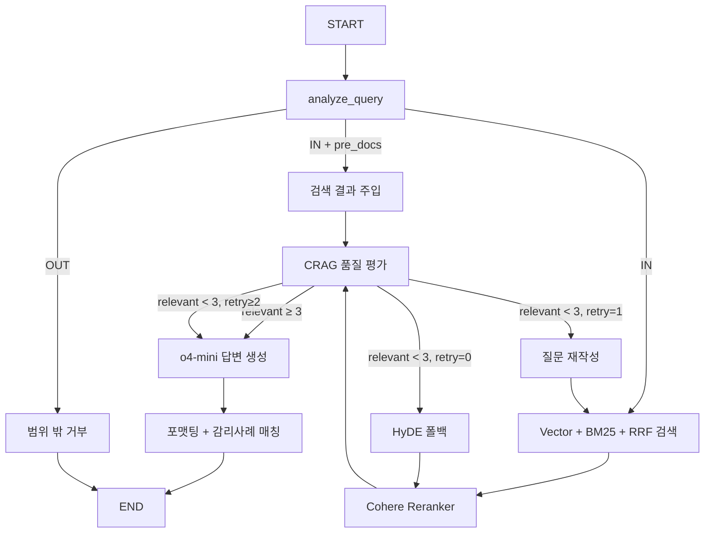

# K-IFRS 1115 Chatbot — 프로젝트 개요

> **이 문서는 LLM에게 프로젝트 컨텍스트를 전달하기 위해 작성되었습니다.**  
> 새로운 대화를 시작할 때 이 문서를 먼저 읽혀주세요.

---

## 1. 프로젝트 목적

회계법인 입사를 위한 **포트폴리오 프로젝트 #1**.

**K-IFRS 제1115호(고객과의 계약에서 생기는 수익)** 에 관하여, **회계감사인(감사인)**들이 객관적인 팩트를 손쉽게 찾고, AI의 추론을 통해 인사이트를 얻을 수 있도록 하는 **전문 챗봇**입니다.

### 핵심 가치

- **환각(Hallucination) 방지가 최우선** — 회계감사에서 환각은 치명적입니다.
- AI가 먼저 답하는 것이 아니라, **사용자가 먼저 팩트(근거 문서)를 확인**한 뒤 AI에게 질문하는 **"근거 선행, AI 후행"** 구조입니다.
- AI는 단순 답변에 그치지 않고, 회계처리의 해석 여지가 있는 부분을 포착하여 **꼬리질문**을 던져 사용자의 질문을 고도화합니다.

---

## 2. 핵심 UX 흐름 (3단계 State Machine)

```
[1단계: 검색 (Search)]
    사용자가 자연어 대화 대신 빈출 QNA 키워드 칩을 클릭
    → 쿼링(검색)을 통해 관련 본문, QNA, 지적사례 등 팩트를 찾아 카드로 제시
    → 추론이 아닌 검색이므로 환각 위험 없음

[2단계: AI 질문 (Chat)]
    검색 결과를 확인한 후, 궁금하거나 애매한 상황을 AI에게 자연어로 질문
    → AI가 답변을 생성하되, 답변 자체가 핵심이 아님

[3단계: 꼬리질문 (Follow-up)]
    AI가 사용자의 상황을 분석하여 해석 여지가 있는 부분을 포착
    → 꼬리질문을 던져 사용자의 허접한 자연어 질문을 점점 완성된 질문으로 업그레이드
    → EX) "현재 재고위험을 누가 부담하고 있나요?", "가격 결정권을 누가 보유하고 있나요?"
    → 반복적인 꼬리질문으로 상황을 구체화한 뒤 최종 회계처리를 제시
```

---

## 3. 기술 스택

| 레이어 | 기술 | 비고 |
|--------|------|------|
| **패키지 관리** | uv | Python ≥ 3.11 |
| **백엔드** | FastAPI + uvicorn | REST API (`/search`, `/chat`, `/health`) |
| **프론트엔드** | Streamlit | 3단계 State Machine UI |
| **RAG 프레임워크** | LangChain + LangGraph | 노드 기반 RAG 파이프라인 |
| **벡터 DB** | MongoDB Atlas Vector Search | `langchain-mongodb` 활용 |
| **임베딩** | Upstage `solar-embedding-1-large` | passage(저장) / query(검색) 구분 필수 |
| **LLM (경량)** | OpenAI `gpt-5-mini` | analyze, rewrite, grade 노드 |
| **LLM (추론)** | OpenAI `o4-mini` | generate 노드 (복합 회계 답변 생성) |
| **Reranker** | Cohere `rerank-multilingual-v3.0` | Cross-encoder 기반 재랭킹 |
| **모니터링** | LangSmith | 개발 환경 트레이싱 |
| **컨테이너** | Docker + docker-compose | 멀티스테이지 빌드 |
| **배포** | Oracle Cloud | Docker로 배포 예정 |

---

## 4. 디렉토리 구조

```
k-ifrs-1115-chatbot/
├── app/
│   ├── api/
│   │   ├── routes.py              # FastAPI 라우터 (/chat, /search, /health)
│   │   └── schemas.py             # Pydantic 요청/응답 스키마
│   ├── nodes/                     # LangGraph 노드 (각 노드 1파일)
│   │   ├── analyze.py             # 질문 분석 + 라우팅 (IN/OUT)
│   │   ├── retrieve.py            # Vector + BM25 + RRF 하이브리드 검색
│   │   ├── rerank.py              # Cohere Reranker 재랭킹
│   │   ├── grade.py               # CRAG 기반 문서 품질 평가
│   │   ├── hyde_retrieve.py       # HyDE 폴백 검색 (가상 문서 생성)
│   │   ├── rewrite.py             # 질문 재작성 (2차 폴백)
│   │   ├── generate.py            # o4-mini 기반 최종 답변 + 꼬리질문 생성
│   │   └── format.py              # 응답 포맷팅 + 감리사례 섀도우 매칭
│   ├── services/                  # 비즈니스 로직 서비스
│   ├── preprocessing/             # 데이터 전처리 파이프라인
│   │   ├── 01-inspect.py          # kifrs.com HTML 구조 분석
│   │   ├── 02-crawl.py            # API 크롤링 → raw JSON
│   │   ├── 03-chunk-with-weight.py # 가중치 청킹
│   │   ├── 04-embed.py            # MongoDB 벡터 적재
│   │   ├── 05-qna-crawl.py        # 질의회신 크롤링
│   │   └── 06-qna-embed.py        # 질의회신 임베딩
│   ├── test/                      # 연결·검색 테스트
│   ├── main.py                    # FastAPI 진입점 (lifespan + CORS + BM25 인덱스 빌드)
│   ├── streamlit_app.py           # Streamlit UI (1182줄, 3단계 State Machine)
│   ├── config.py                  # pydantic-settings 중앙 설정
│   ├── graph.py                   # LangGraph 워크플로우 조립
│   ├── state.py                   # RAGState TypedDict (파이프라인 상태 정의)
│   ├── retriever.py               # 검색 엔진 (Vector + BM25 + RRF 융합)
│   ├── reranker.py                # Reranker 래퍼
│   ├── prompts.py                 # 프롬프트 템플릿 모음
│   └── llm.py                     # LLM 인스턴스 팩토리
├── data/
│   ├── raw/                       # 크롤링 원본 (gitignore)
│   ├── web/                       # 처리된 청크 JSON
│   └── findings/                  # 감리사례 데이터
├── Dockerfile                     # 멀티스테이지 빌드 (uv builder → slim runtime)
├── docker-compose.yml             # api + frontend 오케스트레이션
├── pyproject.toml                 # uv 의존성
├── .env / .env.example            # 환경 변수
└── PROJECT_OVERVIEW.md            # ← 이 파일
```

---

## 5. RAG 파이프라인 (LangGraph)



### 핵심 메커니즘

- **Hybrid Search**: MongoDB Vector Search + BM25 키워드 검색 → RRF(Reciprocal Rank Fusion)로 결합
- **Cross-encoder Reranking**: Cohere `rerank-multilingual-v3.0`으로 의미 기반 재랭킹
- **CRAG (Corrective RAG)**: LLM이 검색 문서의 관련성을 Yes/No로 평가, 부족 시 폴백
- **3단계 폴백**: 1차 HyDE(가상 문서) → 2차 질문 재작성(rewrite) → 3차 있는 근거로 최선
- **꼬리질문 생성**: `generate` 노드에서 답변과 함께 3개의 follow-up 질문을 자동 생성
- **감리사례 섀도우 매칭**: `format` 노드에서 질문과 유사한 감리 지적사례를 자동 매칭

---

## 6. 데이터 소스 및 스키마

### 데이터 소스

| 소스 | 설명 | 상태 |
|------|------|------|
| K-IFRS 1115호 본문 | 기준서 본문 + 적용지침 + 결론도출근거 + 용어정의 | ✅ 완료 |
| 질의회신 (QNA) | kifrs.com 질의회신 데이터 | ✅ 완료 |
| 감리사례 (Findings) | 금감원 감리 지적사례 | ✅ 완료 |

### 청크 스키마 (MongoDB)

```python
{
    "chunk_id": str,          # 고유 식별자
    "content": str,           # 청크 본문
    "source": str,            # "본문", "qna", "findings" 등
    "category": str,          # "본문", "적용지침B", "결론도출근거" 등
    "weight_score": float,    # 카테고리별 검색 가중치
    "hierarchy": str,         # Breadcrumb 경로 (문맥 보강)
    "embedding": list[float], # Upstage solar-embedding 벡터
}
```

---

## 7. 환경 변수

```bash
# MongoDB
MONGO_URI=mongodb+srv://...
MONGO_DB_NAME=kifrs_db
MONGO_COLLECTION_NAME=k-ifrs-1115-chatbot

# API Keys (필수)
UPSTAGE_API_KEY=up_xxx      # 임베딩 전용
OPENAI_API_KEY=sk-xxx        # LLM 전용 (gpt-5-mini, o4-mini)
COHERE_API_KEY=xxx           # Reranker 전용

# LangSmith (선택, 개발용)
LANGCHAIN_API_KEY=lsv2_xxx
LANGCHAIN_TRACING_V2=true
LANGCHAIN_PROJECT=k-ifrs-1115-chatbot
```

---

## 8. 실행 방법

```bash
# ── 로컬 개발 ────────────────────────────────────────────────────
uv sync                                          # 의존성 설치
uv run uvicorn app.main:app --port 8002           # FastAPI 서버
uv run streamlit run app/streamlit_app.py         # Streamlit UI

# ── Docker 배포 ──────────────────────────────────────────────────
docker compose build
docker compose up -d
# → FastAPI: http://localhost:8002
# → Streamlit: http://localhost:8501
```

---

## 9. 코딩 컨벤션

- 파일 하나 **100줄 내외** 유지 (길어지면 즉시 분리)
- 경로·설정값은 파일 상단 상수 또는 `config.py`에 선언 (하드코딩 금지)
- 주석은 **Why** 중심 (What은 코드가 말함)
- LangGraph 노드는 `app/nodes/` 하위에 1파일 1노드 원칙
- 임베딩 모델 **passage / query 혼용 금지** (검색 품질 급락)

---

## 10. 향후 개발 방향

- [ ] Redis 시맨틱 캐시 (반복 질문 API 비용 절감)
- [ ] RAGAS 기반 RAG 품질 평가 자동화 (Faithfulness, Context Precision)
- [ ] LangSmith 골든셋 구축 (100개 이상 K-IFRS 질문)
- [ ] Multi-turn 대화 고도화 (대화 히스토리 컨텍스트 강화)
- [ ] Oracle Cloud 배포

---

## 11. 작업 요청 시 유의사항

이 프로젝트에 대해 작업을 요청할 때 다음을 기억해주세요:

1. **회계 도메인** — K-IFRS 1115호(수익 인식)가 핵심 도메인입니다. 회계 용어와 맥락을 존중해주세요.
2. **환각 방지 설계** — "AI가 먼저 답하고 근거는 나중에" 방식이 아닌, "근거 먼저, AI 나중에" 설계입니다.
3. **꼬리질문이 핵심** — AI의 답변보다 꼬리질문을 통한 질문 고도화가 이 챗봇의 차별화 포인트입니다.
4. **uv로 패키지 관리** — pip이 아닌 uv를 사용합니다 (`uv sync`, `uv run`, `uv add`).
5. **Docker 배포** — 최종 배포는 Docker → Oracle Cloud 서버입니다.
6. **포트폴리오 목적** — 회계법인 입사용 포트폴리오이므로, 코드 품질과 설계 의도의 명확성이 중요합니다.
