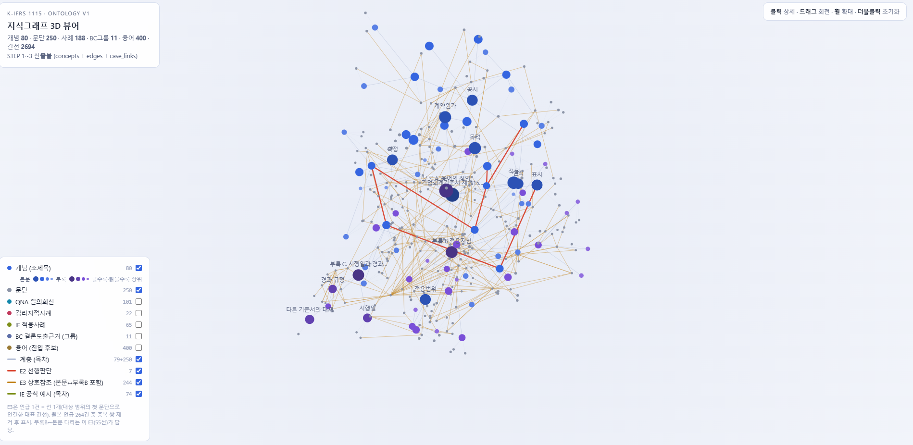

# K-IFRS 1115호 특화 RAG 챗봇

---

## 개요

K-IFRS 제1115호(수익인식) **기준서 원문 기반** 도메인 특화 RAG 챗봇

1. Analyze  : 용어사전 활용한 개념 진입
2. Retrieve : 지식그래프 기반 정보 검색
3. Generate : 판단트리 분기 진입 + 듀얼 LLM(회계추론 or 산술) 라우팅
4. Format   : Pydantic AI를 활용한 정형화된 답변 도출

```
   사용자 질문
       │
       ▼
 ┌──────────────────────── FastAPI  /chat  (SSE 스트리밍) ────────────────────────┐
 │                                                                  ㅤ  ㅤ ㅤ     │
 │   analyze  ───▶   retrieve   ───▶   generate   ───▶   format                │
 │   용어사전        지식그래프 탐색    판단트리 주입         PydanticAI   ㅤㅤ      │
 │   개념진입 (LLM)  개념→문단→사례     듀얼 LLM 라우팅      구조화된 답변ㅤㅤㅤㅤㅤㅤ │
 │                                                     QNA, 감리지적사례, 적용지침ㅤ│
 │                        │                                                       │
 └────────────────────────┼───────────────────────────────────────────────────────┘
                          ▼
                  MongoDB Atlas  (기준서·사례 원문 조회)

```
**실제 사용 스크린샷** 

> **사용자 질문 —** A가 B에게 재화를 100원에 공급하고 세금계산서를 발행, B가 고객 C에게 120원에 판매할 때, A의 매출액은 100원이야 120원이야?

<p align="center">
  
</p>
<p align="center"><sub>좌측은 기준서 근거 문서, 우측은 AI 판단 - 조건에 따라 Case 1·2·3로 분기하고 각 분기에 문단 인용</sub></p>

---

## 1. 문제 인식 

### 범용 LLM 한계와 본 시스템의 해결 방안

| 구분      | 범용 LLM                              | 본 시스템                                      |
| --------- | ------------------------------------- | ---------------------------------------------- |
| 근거 추적 | 블랙박스 형태(조문 추적 어려움)       | 지식 그래프 기반 개념→문단→사례 추적 근거 제시 |
| 재현성    | 동일한 질문에 매번 다른 답            | 동일한 질문에 일관된 기준서 근거 도출          |
| 판단 출처 | 기준서에 없는 판단을 지어낼 위험      | 사전 정의된 판단트리로 추론 절차 통제          |
| 환각 위험 | 그럴듯한 오답 생성(**2종 오류 위험**) | 근거 부족이라고 명확히 응답                    |

### 회계감사의 핵심 리스크: 2종 오류

잘못된 정보를 사실처럼 제시하는 것이 훨씬 큰 비용 초래

| 오류     | 정의                                            | 위험도                          |
| -------- | ----------------------------------------------- | ------------------------------- |
| 1종 오류 | 근거가 존재함에도 찾지 못해 "모른다"고 응답     | 낮음 — 추가 검색으로 보완가능   |
| 2종 오류 | 근거가 없거나 틀린 내용을 확신에 찬 어조로 답변 | **치명적** — 큰 비용으로 이어짐 |

본 파이프라인은 2종 오류의 최소화에 초점을 맞추고 있음
- 통제된 답변: 근거 없는 확정적 답변 생성을 구조적으로 차단
- 엄격한 판단: 기준서에 명시된 확실한 조건에서만 결론을 도출
- 유보적 접근: 내용이 모호하거나 교차 검증이 필요한 경우 조문만 제시하고 최종 판단을 유보

---

## 2. 실증 예시

**질문**(QNA-2017-I-KAQ015-Q1) : 아파트 분양계약으로 고객이 1차 중도금 납부 전엔 해제 가능(위약금 분양대금의 10%), 이후엔 해제불가. 이때 회사가 수행완료분에 대한 집행 가능한 지급청구권을 가져 진행기준을 적용할 수 있는가

  1. analyze (gpt-4.1-mini)
  - 판별1 : 이 질문이 수익인식 기준(1115호) 안의 것인지(→ 맞음)
  - 판별2 : 금액을 계산? 회계추론? (→ 회계추론)
  - 판별3 : 질문에 걸린 용어판별 → 지식그래프의 개념 6개(계약 식별·대체용도 없는 자산·지급청구권·변동대가 등)로 연결
  2. retrieve 
  개념 6개 각각의 기준서 문단 → 참조하는 이웃 문단 → 관련 사례를 그래프를 따라 retrieve(총 문서 159개)
  3. generate 
  기준서를 따라 미리 만들어둔 의사결정나무(문단 35·37·B9·B11)에 주입되어 답변이 분기됨
  - Case 1 — 중도금 전 공정진행률이 10% 미만이면 → 지급청구권을 인정, 진행기준(문단 35·B9)
  - Case 2 — 공정진행률이 10%를 넘는 시점이 있으면 → 그 시점엔 권리가 약해 인도기준(문단 37·B12)
  4. format
  - 인용 없으면 답 없음 
  - 분기 라벨을 필드로 강제 : 답을 산문으로 뽑지 않고 구조적으로 강제
  - 환각 필터 : 실제 컨텍스트에 있던 키만 통과, 없는 사례번호는 걸러짐

---

## 3. 기술 설명 ① 진입점 — 용어사전 

```
 ━━━ [1] analyze : LLM(gpt-4.1-mini) 1회 호출 — 질문 + 멀티턴 구성(최근3턴) ━━━


    ◆ 패스스루 축   →  뒤 노드(generate/format)로 전달
      needs_calculation  ┳ true  = 계산      → gpt-4.1-mini
                         ┗ false = 회계추론  → Gemini Flash
      is_situation       거래당사자, 상황, 계약구조중 2개 이상 존재 → generate clarify(꼬리질문) 분기
                         1개인 경우 → 단순 기준서 찾아주기
      complexity         답이 하나로 정해지는지?  →  simple / complex   → Gemini thinking_level (low / medium)
      confusion_point    사용자 오해 원인(LLM추론)    → clarify 프롬프트 주입(오해 교정)
      provided_info      질문에서 이미 명시한 판단요소  → clarify 재질문 방지

    ◆ 개념 진입 축   →  analyze[2]~[5]로 전달
      topic_hints       max 3개 · 거래 실질상 쟁점이면 지목(고정 35토픽 목록 내)
      standalone_query  멀티턴 재구성 — 회사명·금액 제거(추상화) → 1115호 공식용어로 번역(정규화)
                    
    ◆ 게이트
      routing (1115호 IN / OUT)    
          │ 
          ├── routing = OUT ──▶ 범위 밖 거절 · 파이프라인 종료
          ▼   routing = IN , scope guard : routing=IN 이어도 타기준서 전용어만 존재하고, 1115호 앵커(수행의무·거래가격…)가 없으면 다시 OUT
  ━━━ 개념 진입 ━━━

    [2] topic_hints → 개념   (_resolve_topic_hint)
          topic_map - "수행의무 식별" → "수행의무" 부분매칭 흡수
          → via_topic 확정
          ※ via_topic = "결정적 신호" : retrieve의 케이스·IE, generate의 판단트리 선택 한정
          │
          ▼
    [3] subtree 확장   (_adaptive_subtree)
          via_topic 개념의 형제·하위 개념을 뒤에 붙임 (2순위 · gap 보강)
          부모 하위트리 ≤ 8(subtree_expand_max) → 형제 포함 / 그보다 크면 → 자기 하위만(문단 폭발억제)
          │
          ▼
    [4] 용어사전 조회   (resolve_terms)
          입력 = standalone_query (없으면 사용자 원문)
          aliases 용어(등재 423) 중 입력에 substring으로 걸린 것 → 그 용어의 개념·사례 회수 (LLM 무관)
          │
          ▼
    [5] concept_ids 확정
          1순위(via_topic) → 2순위(subtree) → 3순위(용어사전) 순서로 병합 · 중복 제거
          ※ 개념 순서 = 문단 우선순위 (traverse가 개념 순서대로 문단을 채움 → 질문 주제 문단이 앞자리)
          → retrieve 노드로 넘김 (via_topic · entry_cases 동반)
```
### 용어 사전 구축 방식

1. 초안 생성 (GPT o4-mini)
자주 쓰이는 말(판매장려금·리베이트·풋옵션…)을 GPT(o4-mini)로 1115호 공식용어 2~4개에 매핑
수익인식,거래가격와 같은 범용어에는 매핑되지 않도록 규칙 → 실무어 사전 초안 288개

2. 지식그래프 생성 후 - 용어사전 조립
- ① 진입 어휘 확정
초안 288개 + 사례 제목 123개(질의회신·감리지적사례의 제목) + 부록A 공식 정의 9개
아이템,항공과 같은 단독으로 진입하지 못할 단어들은 제외 
- ② 개념에 연결
각 단어를 그래프 개념에 글자 비교로 자동 연결. (오타·조사 차이 허용 → 대리인 = 본인 대 대리인의 고려사항)
애매한 단어 78개 AI가 → 근거 문단을 보고 판단(그대로 채택 41·손봄 34·사용자 직접 결정3(시상품·아이템·항공))
- ③ 사각지대 보완
단어들이 실제 개념까지 연결되는지 전수 점검 
연결이 부실한 항목 확인 및 본문을 근거로 보완

---

## 4. 기술 설명 ② RAG — 지식그래프

기준서의 명시적 위계 관계를 노드·간선으로 옮긴 지식그래프

```
                     거래가격을 산정함        ← ① 위 : 부모 개념
                           │  (부모–자식)
                           ▼
                     ┌──────────────┐
                     │   변동대가    │ ─── ② 옆 : 형제 개념 3개
                     └───────┬──────┘      (유의적 금융요소 · 비현금대가 · 고객에 지급할 대가)
          ┌────────────────┼────────────────┬────────────────┐
          ▼                ▼                ▼                ▼
     ③ 아래: 자식      ④ 자기 원문        ⑤ 사례           ⑥ 배경(BC)
     환불부채          관할 문단          이 개념을         "왜 변동대가를
     ·제약·재검토      50·51·52·53·54     다룬 QNA·지적사례   제약하나"
                          │
                          └─ ⑦ 문단끼리 "○문단 참조" (상호참조)

변동대가 하나가 이렇게 8~10개와 이어지고, 개념 80개가 다 이렇게 얽히면 → 선 2,694개
```
1. 개념 위계는 AI 판단 없이 기준서 본문 구조로만 구성됨
  - 개념 노드와 그 상하관계(부모–자식)는 기준서의 목차·소제목 위계 "어느 개념이
  - 개념 80개 · 계층 간선 79개 · 관할 문단 250개 배정
2. QNA·감리 사례는 문단으로 1차 연결 → 제목으로 보강
  - 문단 인용이 약하거나 없는 사례→ 제목 자체를 용어사전 별칭으로 등재(123건)해 "제목 → 개념" 진입
  - 문단 인용이 0인 6건은 질의 원문 근거로 개념에 직접 연결

### 관계 종류
  ┌──────────────────┬────────────┬─────────┬────────────────────────────────────────┐
  │   무엇 ↔ 무엇    │    관계    │  개수   │                쉬운 뜻                 │
  ├──────────────────┼────────────┼─────────┼────────────────────────────────────────┤
  │ 개념 ↔ 개념      │ 계층       │      79 │ 큰 주제 밑 작은 주제 (부모–자식)       │
  ├──────────────────┼────────────┼─────────┼────────────────────────────────────────┤
  │ 개념 ↔ 개념      │ 5단계 순서 │       7 │ 먼저 판단 → 나중 판단 (수익인식 5단계) │
  ├──────────────────┼────────────┼─────────┼────────────────────────────────────────┤
  │ 개념 → 문단      │ 관할       │     250 │ 이 개념이 담당하는 원문                │
  ├──────────────────┼────────────┼─────────┼────────────────────────────────────────┤
  │ 문단 ↔ 문단      │ 상호참조   │     264 │ 원문의 "제N문단 참조"                  │
  ├──────────────────┼────────────┼─────────┼────────────────────────────────────────┤
  │ 문단 ↔ 부록B     │ 대응       │       3 │ 본문 규정 ↔ 적용지침                   │
  ├──────────────────┼────────────┼─────────┼────────────────────────────────────────┤
  │ 사례 → 문단·개념 │ 인용       │   1,220 │ 이 사례가 다룬 규정                    │
  ├──────────────────┼────────────┼─────────┼────────────────────────────────────────┤
  │ BC → 문단·개념   │ 배경       │ 190·516 │ "왜 이 규정을 만들었나"                │
  ├──────────────────┼────────────┼─────────┼────────────────────────────────────────┤
  │ 사례 → BC        │ 배경       │      59 │ 이 사례의 취지 근거                    │
  └──────────────────┴────────────┴─────────┴────────────────────────────────────────┘

<p align="center">
  
</p>
<p align="center"><sub>개념을 클릭하면 관할 문단과 <b>이 개념으로 진입하는 용어들</b>이 펼쳐진다. 용어→개념→문단이 눈으로 이어진다.</sub></p>

<p align="center">
  <a href="https://raw.githack.com/ghdtjrgns321-creator/k-ifrs-1115/develop/graph-3d.html">
    
  </a>
</p>
<p align="center"><sub><b>이미지를 클릭하면 회전·확대·노드 클릭이 가능한 인터랙티브 3D 뷰어로 열립니다.</b></sub></p>

<p align="center">
  
</p>
<p align="center"><sub>전체 간선을 켠 모습. E3 상호참조(노란선)와 E2 선행판단(빨간선)이 개념·문단을 관계로 잇는다.</sub></p>

---

## 5. 기술 설명 ③ 판단트리

```
  judgment_trees.json · 트리 `repurchase` (41개 중 1) · trigger 개념 vw8tzF(재매입약정)
  generate._inject_prefix가 via_topic로 이 트리를 골라 "[판단 절차 — 기준서 본문]"으로 주입(calc 경로
  스킵)
  원칙: 모든 분기가 기준서 문단 번호를 근거로 가짐 — AI 창작 0

  재매입약정 (문단 B64~B65) — 세 형태로 1차 분기
  │
  ├─【선도 / 콜옵션】  고객이 자산을 통제하지 못함 (B66)
  │     ├─ 재매입가 < 판매가              ─▶ 리스 (제1116호)
  │     ├─ 재매입가 ≥ 판매가              ─▶ 금융약정 (B68 · 자산 계속 인식 + 금융부채, 차액=이자)
  │     └─ 옵션 미행사·소멸               ─▶ 부채 제거 + 수익 인식 (B69)
  │
  └─【풋옵션】  고객의 재매입 경제적 유인이 유의적인가? (B70~B71)
        ├─ 재매입가 < 판매가
        │     ├─ 유인 유의적              ─▶ 리스              ← 사용자 원본 누락분 복원
        │     └─ 유인 없음                ─▶ 반품권 판매처럼 (B72 → B20~B27)
        ├─ 재매입가 ≥ 판매가
        │     ├─ 예상 시장가치 초과         ─▶ 금융약정 (B73)
        │     └─ 시장가치 이하 + 유인 없음  ─▶ 반품권 판매처럼 (B74)
        └─ 옵션 미행사·소멸               ─▶ 부채 제거 + 수익 인식 (B76)

  [공통] 판매가·재매입가 비교 시 화폐의 시간가치 고려 (B67 · B75)
```

- **원문 앵커 원칙**: 모든 분기가 기준서 문단 번호(`B70`·`B72`)를 근거로 갖는다. AI 창작 없이 본문·부록B에서 조건-분기를 추출했다.
- **구성**: 총 **41개** = 5단계 수익인식 본류·부록B 특수거래를 다룬 핵심 23개(원문 문서로 추출) + 원가·표시·공시 등 추가 발굴 18개.
- **주입 방식**: generate 단계에서 진입 개념과 겹치는 트리를 골라 `[판단 절차]`로 주입해, LLM이 판단 순서를 스스로 조립하는 부담을 없앤다.

기준만 있고 충족 여부가 사례 판단인 지점(예: 변동대가 제약의 "highly probable")은 억지로 분기하지 않고 `[판단 지점]`으로 열어 둔다 — 없는 규칙을 지어내지 않기 위해서다.

---

## 6. 핵심 기술 ④ PydanticAI — 환각을 구조로 막는다

LLM의 역할은 "추론자"가 아니라 "전달자"다. 근거 없는 답을 생성할 수 없도록 5개 레이어로 방어한다.

| #   | 레이어                    | 무엇을 강제하나                                    |
| --- | ------------------------- | -------------------------------------------------- |
| 1   | Domain 큐레이션(판단트리) | 판단 경로를 원문 앵커로 가둠                       |
| 2   | PydanticAI 구조화 출력    | `selected_branches` + `cited_paragraphs` 필드 강제 |
| 3   | result_validator          | 인용이 비면 `ModelRetry`로 자동 재시도             |
| 4   | reasoning_guard           | 핵심 사실 미확인 시 확정(TYPE2)→유보(TYPE1) 강등   |
| 5   | precedents 직접 주입      | 관련 사례를 컨텍스트에 직접 삽입                   |

> **정직한 자백.** 이 시스템은 "환각 0"이 아니다. 검증기는 `cited_paragraphs`가 비었는지만 확인하고, 그 문단이 실제 기준서에 있는지·내용이 맞는지는 검증하지 않는다. 즉 **강제되는 것은 근거의 존재이지 진위가 아니다.** 특정 유형의 환각을 구조적으로 어렵게 만들 뿐이며, 성능은 재현율로 정직하게 보고한다(§7).

**듀얼 LLM 라우팅.** 회계 추론과 산술 정확도는 단일 모델로 양립하지 않는다 — 자체 평가셋 7모델 **218회 A/B** 의 결론이다. 회계 추론 1위 Gemini 3 Flash(종합 0.81)는 진행률 산술에서 20~40%에 그쳤고, gpt-4.1-mini는 산술 100%였다. 그래서 계산이 필요한 질문만 gpt-4.1-mini로 분리 라우팅한다.

---

## 7. 검증 — 실제 질의회신(QNA) 92건 홀드아웃

### 검증셋을 어떻게 만들었나

검증셋은 지어낸 시나리오가 아니라 **사람이 실제로 주고받은 질의회신(QNA)** 에서 만들었다. 회계기준원 API로 수집한 질의회신 원문 101건이 출발점이다.

```
  qna-parents 101건 (질의자·회계기준원·해석위원회 작성 원문)
        │
        ├─ 1115 관련성 필터 ──▶ 통과 88 / 타 기준서 부수 13건 제외
        │        (애매한 17건은 사람이 keep 4 · drop 13 수동 판정)
        │
        ├─ 복수 질문 분리 ──▶ 질의1·2가 뭉친 5건을 질문별로 나눠 +4
        │
        └─ 힌트 유출 차단 (빌드게이트 4종) ──▶ 최종 테스트셋 92건
             · IFRIC 서술문 → 실무자 1인칭 질문으로 재작성
             · 질문에서 정답 문단번호 제거(개념어로 치환)
             · 회신·결론 문구 유출 차단
             · 문단번호 힌트 잔존 시 빌드 실패
```

최종 **92건**(신속처리질의 66 · 정규질의 17 · 해석위원회 9). 정답이 질문에 새어 들어가면 검색이 아니라 암기를 측정하게 되므로, 빌드 단계에서 기계적으로 차단했다.

### 자가순환 차단 — AI가 만든 질문을 AI가 채점하지 않는다

```
 차단 1: 질문 출처 — 개발자 자작 시나리오 ✕
         → 사람이 쓴 실제 질의회신(QNA) 92건 ✓
 차단 2: 답 출처 격리 — 질의회신이 검색되면 자기 답을 자기가 인용 ✕
         → QNA 검색 전면 차단, 기준서 본문 + 판단트리만으로 답변 강제
         → 격리 증명: 92건 검색결과 중 질의회신 유입 0/92
```

즉 "정답이 적힌 질의회신을 못 보게 한 상태에서, 기준서 본문만으로 사람 전문가의 결론을 재현하는가"를 측정한다.

| 지표                     | 값                       |
| ------------------------ | ------------------------ |
| 케이스                   | 실제 질의회신(QNA) 92건  |
| **결론 재현**            | **78/92**                |
| 하드 인용재현율          | 59.1% (인용 0 제외 84건) |
| QNA 격리 (자가순환 차단) | 유입 0/92                |
| 실행 에러                | 0/92                     |

미재현 14건은 전수(14/14) 버킷 분류로 해부했다. **검색·진입으로 실제 고칠 수 있는 것은 1건뿐**이고, 나머지는 타 기준서 인용(코퍼스 밖)·기준서 자체의 개념 교차연결·라우팅 정책 등 검색 밖의 문제였다. 남은 실질 레버는 "헤지 대신 결론 확정" 2~4건뿐이며, 이는 검색이 아니라 생성 계층의 문제다. "고칠 수 없는 것"을 실측으로 확정한 근거는 [`FINAL-REPORT/8_TEST-DECISIONS.md`](FINAL-REPORT/8_TEST-DECISIONS.md).

---

## 8. 트러블슈팅 — 실패를 어떻게 다뤘나

재구축·운영 중 실제로 겪은 사고와 복구를 숨기지 않고 기록했다. 큰 문제 대부분은 코드 한 줄의 버그가 아니라 **"제거·변경이 조용히 부순 것"** 이었다.

| 사고                 | 증상·피해                                            | 근본 원인                                                         | 복구                                              |
| -------------------- | ---------------------------------------------------- | ----------------------------------------------------------------- | ------------------------------------------------- |
| 프로덕션 데이터 유실 | 본문 297/1298만 잔존(1,001 유실) + LLM 제목 986 소실 | 임베딩 단건 1,298회가 레이트리밋 초과 + `delete_many`를 먼저 확정 | 배치(100)+지수 백오프+resume → **1298/1298 복원** |
| 비용 폭증            | generate 주입 평균 138건(최대 299), 월 지출 초과     | 리랭커를 지우자 그것이 겸하던 **문서 상한**도 함께 사라짐         | `generate_doc_limit=12` → 건당 약 **14원**        |

- **delete 후 재적재는 원자성이 없다.** 삭제만 확정되고 삽입이 실패하면 순손실이다 — 트랜잭션이 아니면 삭제를 뒤로 미룬다.
- **제거할 땐 그것이 조용히 하던 일을 세어라.** 리랭커의 숨은 역할(문서 상한)이 사라지자 비용이 터졌다.

전체 사고 5건(성능 최적화·토픽 회귀·판단트리 두더지잡기 포함)과 근본원인·재발 방지는 [`FINAL-REPORT/10_TROUBLESHOOTING.md`](FINAL-REPORT/10_TROUBLESHOOTING.md)에 사고 단위로 기록했다.

---

## 9. 기술 스택

| 레이어          | 기술                          | 비고                                         |
| --------------- | ----------------------------- | -------------------------------------------- |
| 백엔드          | FastAPI + uvicorn             | REST + SSE (`/chat`, `/feedback`, `/health`) |
| 프론트엔드      | Streamlit                     | 근거 선행 UX (좌 근거 문서 / 우 AI 답변)     |
| AI 프레임워크   | PydanticAI                    | 구조화 출력 + result_validator 자동 재시도   |
| 지식 기반       | 온톨로지 JSON + 그래프 코어   | 개념·문단·사례·용어·BC·판단트리              |
| 문서 DB         | MongoDB Atlas                 | 기준서·사례 원문 저장/조회                   |
| LLM (추론)      | Google gemini-3-flash-preview | thinking, 회계 추론 1위                      |
| LLM (분석·산술) | OpenAI gpt-4.1-mini           | analyze · 계산 라우팅(산술 정확도 100%)      |
| 인프라          | Docker · docker-compose · uv  | Python 3.11                                  |

---

## 10. 상세 문서

시스템을 어떻게 설계하고 구축하고 검증했는지는 [`FINAL-REPORT/`](FINAL-REPORT/)에 데이터 흐름 순서로 정리해 두었다(프로젝트 전수 정독 N=321을 census로 고정, 커버리지 부록에서 N/N 증명).

| #   | 문서                                                        | 내용                                                |
| --- | ----------------------------------------------------------- | --------------------------------------------------- |
| 1   | [1_OVERVIEW.md](FINAL-REPORT/1_OVERVIEW.md)                 | 문제 정의(2종 오류), 환각 방지 5레이어, 왜 온톨로지 |
| 2   | [2_PIPELINE.md](FINAL-REPORT/2_PIPELINE.md)                 | 빌드+런타임 전체 파이프라인, 데이터 계보            |
| 3   | [3_DATA-ONTOLOGY.md](FINAL-REPORT/3_DATA-ONTOLOGY.md)       | 데이터 6종 수집→가공, taxonomy 구축, 원천 감사      |
| 4   | [4_KNOWLEDGE-GRAPH.md](FINAL-REPORT/4_KNOWLEDGE-GRAPH.md)   | 노드·간선(E-BC1/2/3), 판단트리, 결정적 탐색         |
| 5   | [5_SEARCH-RUNTIME.md](FINAL-REPORT/5_SEARCH-RUNTIME.md)     | 런타임 4노드, 듀얼 LLM, 검색 우선순위               |
| 6   | [6_INTERFACE.md](FINAL-REPORT/6_INTERFACE.md)               | 근거 선행 UI, Split View, 렌더 경로                 |
| 7   | [7_DIFFERENTIATION.md](FINAL-REPORT/7_DIFFERENTIATION.md)   | 차별점·특장점, 정직한 한계                          |
| 8   | [8_TEST-DECISIONS.md](FINAL-REPORT/8_TEST-DECISIONS.md)     | 92건 홀드아웃, 모델 선택 ADR, 실사용 루프           |
| 9   | [9_JOURNEY.md](FINAL-REPORT/9_JOURNEY.md)                   | 재구축 여정 — 유사도·가중치·리랭커를 버린 이유      |
| 10  | [10_TROUBLESHOOTING.md](FINAL-REPORT/10_TROUBLESHOOTING.md) | 운영 사고·디버깅 교훈(데이터 유실·비용 폭증 등)     |
| 11  | [11_COVERAGE.md](FINAL-REPORT/11_COVERAGE.md)               | 전수 커버리지 부록 (census N/N 증명)                |

### 재구축 여정 (요약)

초기 구조는 벡터 임베딩 + BM25 + RRF + 가중치 + 핀포인트 + Cohere 리랭커의 복합체였다. 리랭커는 전문가 배정 문서를 105건 중 103건이나 탈락시켰고, 가중치는 근거를 댈 수 없었으며, 같은 질문에도 라우팅이 흔들렸다. 이 균열이 드러나자 **진입부를 통째로 걷어내고 온톨로지 지식그래프로 전환**했다. 전환 뒤 사람이 작성한 92건 홀드아웃으로 검증하고, 남은 실패의 경계를 실측으로 확정했다. 전말은 [`FINAL-REPORT/9_JOURNEY.md`](FINAL-REPORT/9_JOURNEY.md).
