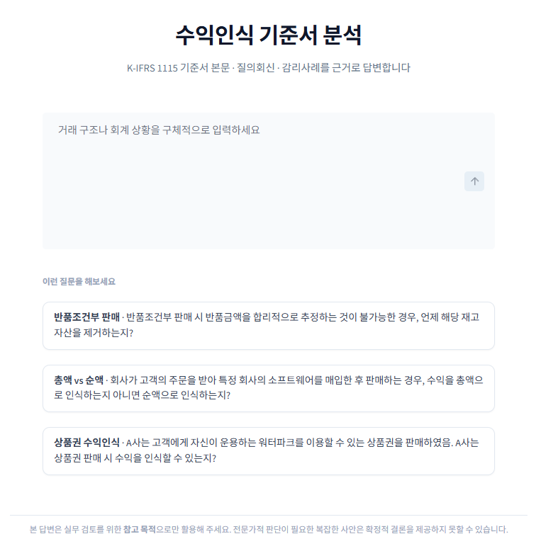
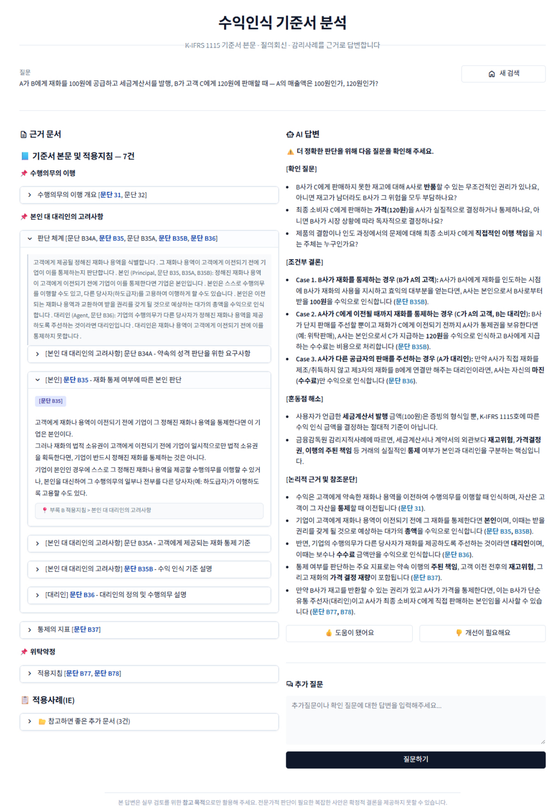
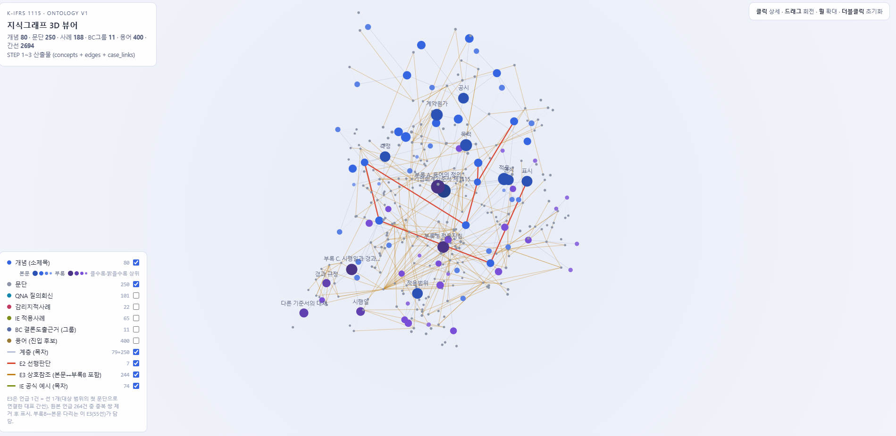

# K-IFRS 1115 통합 문헌 감사 어시스턴트


<p align="center">
  
</p>

---

## 개요

수익인식 회계기준(K-IFRS 제1115호)에 대한 감사인·회계 실무자의 질문에, **기준서 원문 근거를 추적해** 답하는 도메인 특화 RAG 챗봇이다. 실무자가 조문 근거를 손쉽게 찾고, AI의 구조화된 가이드로 판단하도록 돕는다.

핵심은 검색 방식에 있다. 대부분의 RAG가 임베딩 유사도로 "비슷한 문서"를 끌어오는 것과 달리, 이 시스템은 기준서가 이미 가진 **명시적 관계(개념·문단·사례·용어를 잇는 지식그래프)** 위에서 근거를 결정적으로 탐색한다. 검색 진입부에 유사도·가중치·리랭커가 없다 — "비슷한 것" 대신 **"연결된 것"** 을 가져온다. 그 결과 "이 근거가 왜 뽑혔는지"를 경로로 설명할 수 있고, AI가 없는 판단을 지어내기 어렵다.

```
   사용자 질문
       │
       ▼
 ┌─────────────────────── FastAPI  /chat  (SSE 스트리밍) ───────────────────────┐
 │                                                                              │
 │   analyze  ───▶   retrieve   ───▶   generate   ───▶   format                 │
 │   개념 진입        그래프 탐색        답변 생성          넛지·정리                │
 │   용어사전+LLM     개념→문단→사례     판단트리 주입      감리지적 경고            │
 │   (유사도 0)       (결정적 1-hop)    듀얼 LLM 라우팅    (꼬리질문)              │
 │                        │                                                     │
 └────────────────────────┼─────────────────────────────────────────────────────┘
                          ▼
                  MongoDB Atlas  (기준서·사례 원문 조회)

 지식그래프:  개념 80 · 문단 250 · 사례 188 · 용어 423 · BC 21 · 판단트리 41
```

---

## 1. 문제 인식 — 2종 오류를 막는다

수익인식은 실무자가 자주 막히고, 답이 틀리면 재무제표가 왜곡되는 영역이다. 범용 LLM은 그럴듯한 답을 즉시 내놓지만 근거 조문을 추적할 수 없고, 기준서에 없는 판단을 지어낸다.

| 오류                | 정의                              | 위험도                         |
| ------------------- | --------------------------------- | ------------------------------ |
| 1종 오류(놓침)      | 근거가 있는데 못 찾아 "모른다"    | 낮음 — 추가 검토로 해소        |
| 2종 오류(허위 확정) | 근거가 없거나 틀린데 확신에 찬 답 | **치명적** — 부실감사로 이어짐 |

설계 전반이 2종 오류를 줄이는 쪽으로 편향된다. "확실할 때만 확정하고, 애매하면 근거를 보여주며 유보한다." 이 시스템은 환각 0을 주장하지 않는다 — 근거 없는 확정을 **구조적으로 어렵게** 만들고, 검증 결과를 재현율로 정직하게 보고한다.

**예시.** "A가 B에게 재화를 100원에 공급하고, B가 고객 C에게 120원에 판매할 때 A의 매출은 100원인가 120원인가?" — 시스템은 단정하지 않는다. 본인/대리인 판단 조건에 따라 Case 1(120원)·Case 2(100원)로 분기하고, 각 분기에 기준서 문단을 인용한다.

<p align="center">
  
</p>

<p align="center"><sub>위 예시의 실제 답변 화면. 좌측은 기준서 근거 문서(문단 31·35·35B·36 등), 우측은 AI 판단 — 단정 대신 통제권 조건에 따라 Case 1·2·3로 분기하고 각 분기에 문단을 인용한다.</sub></p>

---

## 2. 시스템 흐름 — 질문에서 답변까지

개요의 파이프라인을 노드별로 상술한다. LangGraph 없이 순수 Python으로 오케스트레이션하며, 각 노드는 부분 결과를 상태에 병합하고 SSE로 진행 상황을 스트리밍한다.

| 노드     | 역할                                                 | LLM                              |
| -------- | ---------------------------------------------------- | -------------------------------- |
| analyze  | 개념 진입(용어사전 + LLM 주제 지목) · 범위 라우팅    | gpt-4.1-mini                     |
| retrieve | 그래프 탐색 → MongoDB 원문 조회 (진입 우선순위 보존) | — (LLM 미사용)                   |
| generate | 답변 생성 + 판단트리·근거경로 주입, 듀얼 LLM 라우팅  | Gemini Flash / 계산→gpt-4.1-mini |
| format   | 감리지적사례 경고 + 꼬리질문                         | —                                |

핵심은 **진입부(analyze)** 다. 질문을 개념 노드로 잇는 두 경로 모두 임베딩 유사도를 쓰지 않는다.

```
  질문
   ├─▶ ① 용어사전 substring 조회 (결정적)      "리베이트" → [변동대가]
   └─▶ ② LLM(gpt-4.1-mini)이 35개 토픽에서 주제 지목 (개념 80을 직접 고르지 않음)
                    │
                    ▼   graph.resolve_question()  ← 토픽→개념 변환은 100% 그래프 로직
              진입 개념 확정 → routing IN/OUT (범위 판정)
```

- **진입부 결정성**: LLM은 토픽만 지목하고, 토픽→개념 변환·후보 산출은 그래프 로직이 수행한다. LLM이 개념 ID를 직접 만들지 않으므로, AI 오류가 "내용 오염"이 아니라 "검색 실패"로 안전하게 드러난다.
- **듀얼 LLM 라우팅**: 회계 추론(Gemini Flash)과 산술(gpt-4.1-mini, 산술 정확도 100%)은 단일 모델로 양립하지 않는다는 218회 A/B 테스트 결론에 따른 분리.
- **PydanticAI 구조화 출력**: '근거'와 '결론' 분리를 코드 수준에서 강제, result_validator + 자동 재시도.

---

## 3. 왜 지식그래프인가

초기 구조는 벡터 유사도 기반의 전형적 RAG였다. 일상어 질문과 법조문체 원문의 유사도는 낮았고(절대값 0.29~0.47), 검색 순위를 좌우하는 가중치는 근거를 설명할 수 없었다. 회계 기준서는 5단계 수익인식 모형, 문단 상호참조, 부록이 본문에 매달리는 관계 등 **명시적 구조**를 이미 갖고 있다 — 이 관계는 원문에 적혀 있어 확률이 아니라 사실이다.

```
   임베딩 방식                         온톨로지 방식 (현행)
 ┌──────────────┐                  ┌──────────────┐
 │ "비슷한 것"    │                  │ "연결된 것"    │
 │ 유사도 상위 N  │                  │ 명시적 관계    │
 └──────┬───────┘                  └──────┬───────┘
        │ 확률적 · 설명 불가               │ 결정적 · 경로 제시 가능
        ▼                                ▼
   근소한 점수차로 흔들림             개념 → 문단 → 상호참조 이웃 → 사례
   "왜 이 문서?" 설명 불가            "이 근거는 이 경로로 왔다"
```

AI가 개입하는 지점은 사람이 전수 검수할 수 있는 크기의 **용어 색인 하나로 제한**한다. 색인이 틀리면 오류는 "검색 실패(근거 빈약)"로 드러나지, "그럴듯한 거짓 답변(내용 오염)"으로 드러나지 않는다.

---

## 4. 지식 기반

기준서가 가진 명시적 관계를 노드·간선으로 옮긴 지식그래프(`data/ontology/`). **개념**을 허브로, 문단·사례·BC·용어가 관계로 매달린다.

```
                          ┌──────────────┐
                          │   개념 (80)   │   기준서 목차·소제목이 허브
                          └──────┬───────┘
        ┌────────────┬──────────┼──────────┬────────────┐
        ▼            ▼          ▼          ▼            ▼
   ┌─────────┐  ┌─────────┐ ┌────────┐ ┌────────┐ ┌──────────┐
   │문단 250 │  │사례 188 │ │ BC 21  │ │용어 423│ │판단트리 41│
   │기준서   │  │QNA·감리 │ │결론도출│ │질문→개념│ │본문·부록B│
   │원문     │  │·IE 사례 │ │근거    │ │진입 색인│ │정답 절차 │
   └─────────┘  └─────────┘ └────────┘ └────────┘ └──────────┘
     관할 문단     사례 연결   근거 매핑   진입(유사도0)  판단 주입
```

| 노드/간선        | 개수                            | 파일                   |
| ---------------- | ------------------------------- | ---------------------- |
| 개념             | 80 (문단 250 배정)              | concepts.json          |
| 사례             | 188 (QNA 101 · 감리 22 · IE 65) | case_links.json        |
| 용어             | 423 엔트리                      | aliases.json           |
| 간선             | 상호참조 264 등 (고립 노드 0)   | edges.json             |
| BC(결론도출근거) | 그룹 21                         | bc_links.json          |
| 판단트리         | 41 (본문·부록B 원문 앵커)       | judgment_trees.json    |
| 토픽→개념 매핑   | 33 토픽                         | topic_concept_map.json |

<details>
<summary><b>실제 지식그래프 전체 보기</b> — 클릭하면 인터랙티브 3D 뷰어로 열립니다</summary>

<br>

<a href="https://raw.githack.com/ghdtjrgns321-creator/k-ifrs-1115/develop/graph-3d.html">
  
</a>

전체 노드가 한 화면에 뭉쳐 보이지만, 실제로는 **간선 2694개 · 고립 노드 0개**로 모든 노드가 관계로 연결되어 있다. 위 이미지를 클릭하면 회전·확대·노드 클릭이 가능한 인터랙티브 뷰어가 열린다.

</details>

---

## 5. 검증 — 실제 질의회신(QNA) 92건 홀드아웃

검증셋은 지어낸 시나리오가 아니라 **사람이 실제로 주고받은 질의회신(QNA) 92건**으로 만들었다. 질의자·회계기준원·해석위원회가 작성한 실제 문답이 출처다. 여기에 AI가 만든 질문을 AI가 채점하는 **자가순환**을 두 겹으로 차단했다.

```
 차단 1: 질문 출처 — 개발자 자작 시나리오 ✕
         → 사람이 쓴 실제 질의회신(QNA) 92건 ✓
 차단 2: 답 출처 격리 — 질의회신이 검색되면 자기 답을 자기가 인용 ✕
         → QNA 검색 전면 차단, 기준서 본문 + 판단트리만으로 답변 강제
         → 격리 증명: 92건 검색결과 중 질의회신 유입 0/92
```

즉 "정답이 적힌 질의회신을 못 보게 한 상태에서, 기준서 본문만으로 사람 전문가의 결론을 재현하는가"를 측정한다.

| 지표                     | 값                      |
| ------------------------ | ----------------------- |
| 케이스                   | 실제 질의회신(QNA) 92건 |
| **결론 재현**            | **78/92**               |
| QNA 격리 (자가순환 차단) | 유입 0/92               |
| 실행 에러                | 0/92                    |

### 미재현 14건 — 왜 못 맞혔나

미재현 14건을 전수(14/14) 버킷 분류로 해부했다. **검색·진입 파이프라인으로 실제 고칠 수 있는 것은 1건뿐**이고, 나머지는 검색 밖의 문제였다.

| 버킷             | 건수 | 실패 이유                                                       | 검색으로 고쳐지나         |
| ---------------- | ---- | --------------------------------------------------------------- | ------------------------- |
| A. 진입 누락     | 2    | gold 개념에 진입 자체가 실패                                    | 코사인으로 1건만 실익     |
| D. 개념 교차연결 | 4    | 기준서가 개념을 교차연결하고 판단트리가 정답규칙을 이미 주입 중 | 아니오 (고칠 대상 아님)   |
| OUT. 범위 밖     | 2    | 라우팅이 1115 범위 밖으로 판정, gold 회수 0                     | 아니오 (라우팅 정책 문제) |
| 기타. 소프트축   | 6    | 타 기준서 4건(1115 코퍼스 밖 인용 불가) + 헤지 2건(결론 미확정) | 대부분 아니오             |

합계 A2 + D4 + OUT2 + 기타6 = **14**. 검색 재설계로 남는 실질 레버는 "헤지 대신 결론 확정" 2~4건뿐이며, 이는 검색이 아니라 생성 계층의 문제다. "고칠 수 없는 것"을 실측으로 확정한 근거는 [`FINAL-REPORT/6_TEST-DECISIONS.md`](FINAL-REPORT/6_TEST-DECISIONS.md).

---

## 6. 기술 스택

| 레이어          | 기술                          | 비고                                        |
| --------------- | ----------------------------- | ------------------------------------------- |
| 백엔드          | FastAPI + uvicorn             | REST + SSE (`/search`, `/chat`, `/health`)  |
| 프론트엔드      | Streamlit                     | 3단계 State Machine UI (근거 선행, AI 후행) |
| AI 프레임워크   | PydanticAI                    | 구조화 출력 + result_validator 자동 재시도  |
| 지식 기반       | 온톨로지 JSON + 그래프 코어   | 개념·문단·사례·용어·BC·판단트리             |
| 문서 DB         | MongoDB Atlas                 | 기준서·사례 원문 저장/조회                  |
| LLM (추론)      | Google gemini-3-flash-preview | thinking, 회계 추론 1위                     |
| LLM (분석·산술) | OpenAI gpt-4.1-mini           | analyze · 계산 라우팅(산술 정확도 100%)     |
| 인프라          | Docker · docker-compose · uv  | Python 3.11                                 |

---

## 7. Quickstart

### 환경 변수

```bash
cp .env.example .env
# .env 파일에 API 키 입력 (OPENAI / GOOGLE / UPSTAGE / MONGO_URI)
```

### Docker 배포

```bash
docker compose up -d --build
```

- Streamlit UI: http://localhost:8501
- FastAPI Swagger: http://localhost:8002/docs

### 로컬 개발

```bash
uv sync
uv run uvicorn app.main:app --port 8002       # 백엔드
uv run streamlit run app/streamlit_app.py      # 프론트엔드 (별도 터미널)
```

---

## 8. 상세 문서

시스템의 설계·구축·검증 전 과정은 [`FINAL-REPORT/`](FINAL-REPORT/)에 데이터 흐름 순서로 기록되어 있다.

| #   | 문서                                                      | 내용                                           |
| --- | --------------------------------------------------------- | ---------------------------------------------- |
| 1   | [1_OVERVIEW.md](FINAL-REPORT/1_OVERVIEW.md)               | 문제 정의(2종 오류), 왜 온톨로지인가           |
| 2   | [2_DATA-TAXONOMY.md](FINAL-REPORT/2_DATA-TAXONOMY.md)     | 데이터 6종 수집→가공, taxonomy 구축 방법론     |
| 3   | [3_KNOWLEDGE-GRAPH.md](FINAL-REPORT/3_KNOWLEDGE-GRAPH.md) | 지식그래프 노드·간선, 판단트리, 검증 로그      |
| 4   | [4_SEARCH-PIPELINE.md](FINAL-REPORT/4_SEARCH-PIPELINE.md) | 런타임 4노드 흐름, 주제기반 다중주입           |
| 5   | [5_INTERFACE.md](FINAL-REPORT/5_INTERFACE.md)             | 3단계 UI와 Split View 근거 추적                |
| 6   | [6_TEST-DECISIONS.md](FINAL-REPORT/6_TEST-DECISIONS.md)   | 92건 홀드아웃 검증, 모델 선택 ADR              |
| 7   | [7_JOURNEY.md](FINAL-REPORT/7_JOURNEY.md)                 | 재구축 여정 — 유사도·가중치·리랭커를 버린 이유 |

## 재구축 여정 (요약)

초기 구조는 벡터 임베딩 + BM25 + RRF + 가중치 + 핀포인트 + Cohere 리랭커의 복합체였다. 리랭커가 전문가 배정 문서를 105건 중 103건 탈락시키고, 가중치의 근거를 설명할 수 없으며, 동일 질문에 라우팅이 흔들리는 균열이 드러나자 **진입부를 통째로 걷어내고 온톨로지 지식그래프로 전환**했다. 전환 후 사람 작성 92건 홀드아웃으로 검증하고, 남은 실패의 경계를 실측으로 확정했다. 전말은 [`FINAL-REPORT/7_JOURNEY.md`](FINAL-REPORT/7_JOURNEY.md).
