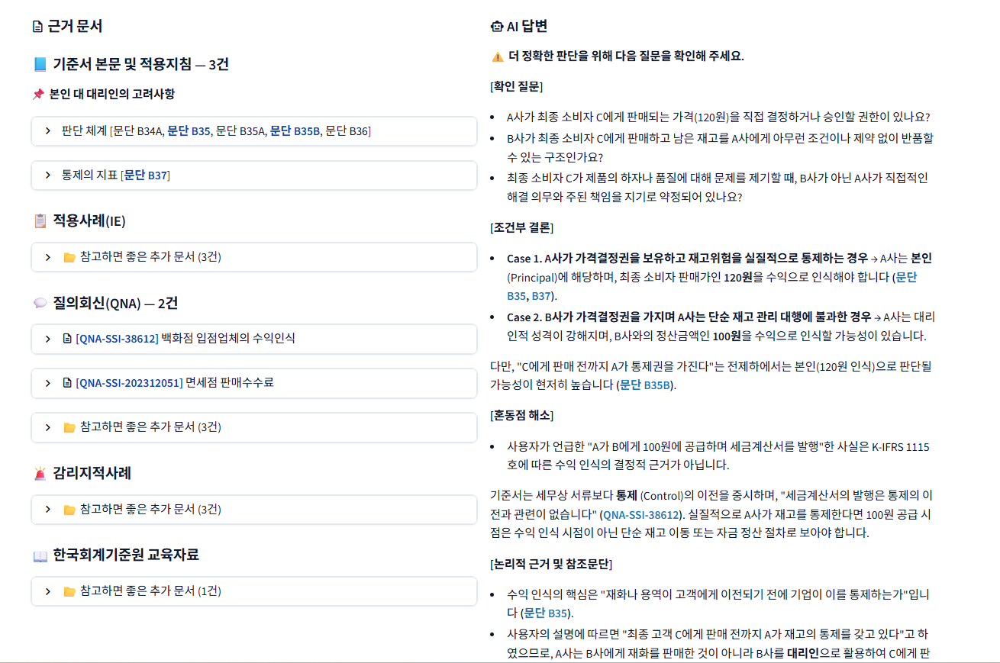

# K-IFRS 1115 통합 문헌 감사 어시스턴트

> **환각을 차단하는 회계감사 도메인 특화 RAG 시스템**
> 검증된 기준서 원문과 Decision Tree 안에서만 답변한다.


**[프로젝트 상세 보기 →](https://ghdtjrgns321-creator.github.io/myprofile/project_kifrs.html)**

| 예시 질문 |
| :-- |
| A가 B에게 재화를 100원에 공급하고 세금계산서를 발행, B가 고객 C에게 120원에 판매할 때 — A의 매출액은 **100원**인가, **120원**인가? |



---

## 핵심 특징

| 기능 | 설명 |
|------|------|
| **Decision Tree 강제** | 토픽별 의사결정 트리로 정해진 Case 분기 내에서만 결론 도출 — AI 자의적 추론 차단 |
| **PydanticAI 구조화 출력** | '근거'와 '결론' 분리를 코드 수준에서 강제 — AI 답변의 변동성 억제 |
| **핀포인트&nbsp;+&nbsp;Reranker&nbsp;검색** | 사전 배정 문서 직접 조회 + 실무 약칭 자동 확장("묶음 판매" → 복수의 수행의무·거래가격 배분) |
| **도메인 데이터 적재** | 기준서 원문·적용사례·질의응답·감리지적사항·교육자료 등 **1,575건**을 DB에 구축 |
| **근거 선행, AI 후행** | 적재 문서를 AI 호출 **전에** SUMMARY와 함께 열람 — 근거 확인 후 답변 |
| **Split View 근거 추적** | AI 답변과 인용 근거를 한 화면에서 동시 확인 — 참조 문단은 볼드 처리 |

---

## 왜 다른가

범용 LLM을 회계 기준서 해석에 그대로 쓰면 근거 없는 답변을 생성하는 **환각**에 노출되고, 이는 감사 실무에서 AI를 과대신뢰하는 2종 오류로 이어진다. 이 시스템은 유연성을 포기하고 **무결성**에 집중한다.

| 항목         | 일반 ChatGPT              | 이 시스템                                  |
|--------------|---------------------------|--------------------------------------------|
| 답변 근거    | 학습 데이터에서 자유 추론   | DB에 저장된 기준서 원문만 사용               |
| 근거 추적    | 어려움 (출처 불명)         | 문단 번호 단위로 추적 가능                   |
| 환각 방지    | 없음                      | 5-Layer 파이프라인                           |
| 결론 구조    | 자유형 텍스트              | Decision Tree 체크리스트 + Case 분기         |
| 정보 부족 시 | 근거 없이 단정 위험        | 조건부 결론(Case 1/2)으로 분기 제시          |
| 모델         | 단일 모델                 | 듀얼 LLM 라우팅 — 질문 유형별 최적 모델 자동 선택 |

---

## 환각 방지 5-Layer Pipeline

데이터 적재부터 최종 답변까지 전 과정을 통제하는 **확정적(Deterministic) 아키텍처**:

1. **도메인 데이터 적재** — 1115호 본문·관련 사례·지적사례 1,575건을 DB에 저장
2. **핀포인트 + Reranker 검색**
   - Tier 1 핀포인트: Decision Tree 사전 배정 문서 ID로 DB 직접 조회 → 핵심 근거 누락 0%
   - Tier 2 하이브리드 보충: 벡터 + BM25 + RRF 융합, 실무 약칭 자동 인식(15개 매핑) + 카테고리 가중치(본문·적용지침 1.3 / 감리 1.2 / BC 0.8)
   - Cohere Cross-encoder 재평가: 1차 결과 30건 재평가, 핀포인트 문서는 보호
3. **듀얼 LLM 라우팅** — Gemini Flash(회계추론 1위) + gpt-4.1-mini(산술 100%) 질문 유형별 자동 선택
4. **Decision Tree 강제** — 정보 부족 시 임의 판단 대신 조건부 결론(Case 분기) 도출
5. **PydanticAI 구조화 출력** — '근거'와 '결론' 분리 강제, result_validator + 자동 재시도

---

## 아키텍처

```
사용자 질문
  │
  ▼
[Analyze]  gpt-4.1-mini — 질문 분석·라우팅 (10개 판단 항목)
  │
  ▼
[Retrieve] 2계층 검색 — 핀포인트 + 하이브리드 (병렬)
  │
  ▼
[Rerank]   Cohere Cross-encoder — 도메인 가중치 + 핀포인트 보호
  │
  ▼
[Generate] 듀얼 LLM 라우팅 — Gemini(판단) / gpt-4.1-mini(계산)
  │
  ▼
[Format]   감리사례 경고 + 꼬리질문 + 인용 정리
```

| 레이어       | 기술                                                                              |
|-------------|-----------------------------------------------------------------------------------|
| **Backend**  | FastAPI · uvicorn · PydanticAI (structured output + 자동 재시도)                   |
| **Frontend** | Streamlit (4단계 State Machine UI)                                                 |
| **AI/ML**    | Gemini Flash (thinking) · gpt-4.1-mini · Cohere Reranker · Upstage Solar Embedding |
| **Database** | MongoDB Atlas Vector Search (벡터 + 메타데이터 필터 + PDR)                          |
| **Infra**    | Docker · docker-compose · uv (Python 3.11)                                         |

---

## 품질 검증

모델 선정(218회) → 검색 테스트(101회) → 품질 테스트(301회), 3단계 총 **620회 호출**로 검증했다.

| 지표                   | 값                | 의미                                  |
|------------------------|-------------------|---------------------------------------|
| 총 검증 호출 수         | **620회**         | 모델 218 + 검색 101 + 품질 301        |
| 최종 골든 테스트 통과율  | **88.7%** (47/53) | 7개 유형 53건 전수 검증                |
| 환각 발생률            | **0%**            | 전체 테스트에서 근거 없는 답변 0건      |
| 라우팅 정확도          | **100%**          | AI 판단 전환 후 42/42                  |
| 계산 정답률            | **100%**          | 듀얼 LLM 라우팅 확정 후                |
| 응답시간 중위값         | **25.3초**        | Gemini thinking=medium 기준           |

> 통과율 88.7%의 Issue 6건은 "토픽 매칭이 기대와 다름(답변은 정확)", "응답 시간이 긴 편" 수준의 **메타데이터·완성도 이슈**이며, 잘못된 정보 생성이나 근거 없는 단정은 **0건**이다.

---

## Quickstart

### 환경 변수

```bash
cp .env.example .env
# .env 파일에 API 키 입력 (OPENAI / UPSTAGE / COHERE / GOOGLE / MONGO_URI)
```

### Docker 배포

```bash
docker compose up -d --build
```

- Streamlit UI: http://localhost:8501
- FastAPI Swagger: http://localhost:8002/docs

### 로컬 개발

```bash
uv sync
uv run uvicorn app.main:app --port 8002       # 백엔드
uv run streamlit run app/streamlit_app.py      # 프론트엔드 (별도 터미널)
```
