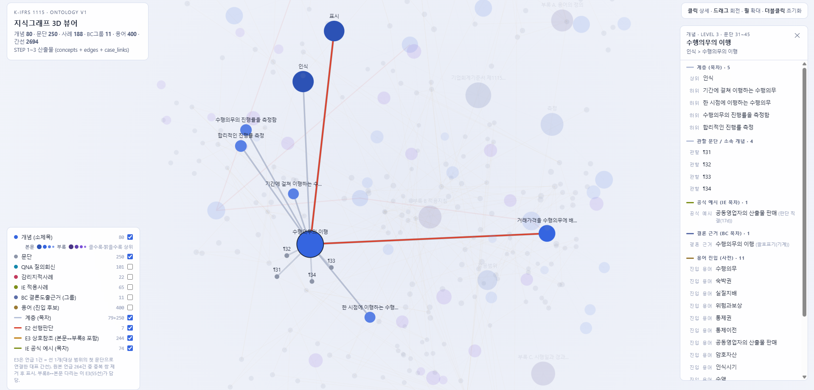

# K-IFRS 1115호 특화 RAG 챗봇

> **라이브 데모 배포 → http://134.185.104.224:8501/** (Oracle Cloud 배포, Streamlit)

---

## 개요

K-IFRS 제1115호(수익인식) **기준서 원문 기반** 도메인 특화 RAG 챗봇

1. Analyze  : 용어사전 활용한 개념 진입
2. Retrieve : 지식그래프 기반 정보 검색
3. Generate : 판단트리 분기 진입 + 듀얼 LLM(회계추론 or 산술) 라우팅
4. Format   : Pydantic AI를 활용한 정형화된 답변 도출

```
   사용자 질문
       │
       ▼
 ┌──────────────────────── FastAPI  /chat  (SSE 스트리밍) ────────────────────────┐
 │                                                                  ㅤ  ㅤ ㅤ     │
 │   analyze  ───▶   retrieve   ───▶   generate   ───▶   format                │
 │   용어사전        지식그래프 탐색    판단트리 주입         PydanticAI   ㅤㅤ     │
 │   개념진입 (LLM)  개념→문단→사례     듀얼 LLM 라우팅      구조화된 답변ㅤㅤㅤㅤㅤ │
 │                                                     QNA, 감리지적사례, 적용지침 │
 │                        │                                                       │
 └────────────────────────┼───────────────────────────────────────────────────────┘
                          ▼
                  MongoDB Atlas  (기준서·사례 원문 조회)

```
**실제 사용 스크린샷** 

> **사용자 질문 —** A가 B에게 재화를 100원에 공급하고 세금계산서를 발행, B가 고객 C에게 120원에 판매할 때, A의 매출액은 100원이야 120원이야?

<p align="center">
  
</p>
<p align="center"><sub>좌측은 기준서 근거 문서, 우측은 AI 판단 - 조건에 따라 Case 1·2·3로 분기하고 각 분기에 문단 인용</sub></p>

---

## 1. 문제 인식 

### 범용 LLM 한계와 본 시스템의 해결 방안

| 구분      | 범용 LLM                              | 본 시스템                                      |
| --------- | ------------------------------------- | ---------------------------------------------- |
| 근거 추적 | 블랙박스 형태(조문 추적 어려움)       | 지식 그래프 기반 개념→문단→사례 추적 근거 제시 |
| 재현성    | 동일한 질문에 매번 다른 답            | 동일한 질문에 일관된 기준서 근거 도출          |
| 판단 출처 | 기준서에 없는 판단을 지어낼 위험      | 사전 정의된 판단트리로 추론 절차 통제          |
| 환각 위험 | 그럴듯한 오답 생성(**2종 오류 위험**) | 근거 부족이라고 명확히 응답                    |

### 회계감사의 핵심 리스크: 2종 오류

잘못된 정보를 사실처럼 제시하는 것이 훨씬 큰 비용 초래

| 오류     | 정의                                            | 위험도                          |
| -------- | ----------------------------------------------- | ------------------------------- |
| 1종 오류 | 근거가 존재함에도 찾지 못해 "모른다"고 응답     | 낮음 — 추가 검색으로 보완가능   |
| 2종 오류 | 근거가 없거나 틀린 내용을 확신에 찬 어조로 답변 | **치명적** — 큰 비용으로 이어짐 |

본 파이프라인은 2종 오류의 최소화에 초점을 맞추고 있음
- 통제된 답변: 근거 없는 확정적 답변 생성을 구조적으로 차단
- 엄격한 판단: 기준서에 명시된 확실한 조건에서만 결론을 도출
- 유보적 접근: 내용이 모호하거나 교차 검증이 필요한 경우 조문만 제시하고 최종 판단을 유보

---

## 2. 실증 예시

**질문**(QNA-2017-I-KAQ015-Q1) : 아파트 분양계약으로 고객이 1차 중도금 납부 전엔 해제 가능(위약금 분양대금의 10%), 이후엔 해제불가. 이때 회사가 수행완료분에 대한 집행 가능한 지급청구권을 가져 진행기준을 적용할 수 있는가

  1. analyze (gpt-4.1-mini)
  - 판별1 : 이 질문이 수익인식 기준(1115호) 안의 것인지(→ 맞음)
  - 판별2 : 금액을 계산? 회계추론? (→ 회계추론)
  - 판별3 : 질문에 걸린 용어판별 → 지식그래프의 개념 6개(계약 식별·대체용도 없는 자산·지급청구권·변동대가 등)로 연결
  2. retrieve 
  - 개념 6개 각각의 기준서 문단 → 참조하는 이웃 문단 → 관련 사례를 그래프를 따라 retrieve(총 문서 159개)
  3. generate 
  - 기준서를 따라 미리 만들어둔 의사결정나무(문단 35·37·B9·B11)에 주입되어 답변이 분기됨
    - Case 1 — 중도금 전 공정진행률이 10% 미만이면 → 지급청구권을 인정, 진행기준(문단 35·B9)
    - Case 2 — 공정진행률이 10%를 넘는 시점이 있으면 → 그 시점엔 권리가 약해 인도기준(문단 37·B12)
  4. format
  - 인용 없으면 답 없음 
  - 분기 라벨을 필드로 강제 : 답을 산문으로 뽑지 않고 구조적으로 강제
  - 환각 필터 : 실제 컨텍스트에 있던 키만 통과, 없는 사례번호는 걸러짐

---

## 3. 기술 설명 ① 진입점 — 용어사전 

```
 ━━━ [1] analyze : LLM(gpt-4.1-mini) 1회 호출 — 질문 + 멀티턴 구성(최근3턴) ━━━


    ◆ 패스스루 축   →  뒤 노드(generate/format)로 전달
      needs_calculation  ┳ true  = 계산      → gpt-4.1-mini
                         ┗ false = 회계추론  → Gemini Flash
      is_situation       계약당사자, 거래조건, 계약구조 중 2개 이상 존재 → generate clarify(꼬리질문) 분기
                         1개인 경우 → 단순 기준서 찾아주기
      complexity         답이 하나로 정해지는지?  →  simple / complex   → Gemini thinking_level (low / medium)
      confusion_point    사용자 오해 원인(LLM추론)    → clarify 프롬프트 주입(오해 교정)
      provided_info      질문에서 이미 명시한 판단요소  → clarify 재질문 방지

    ◆ 개념 진입 축   →  analyze[2]~[5]로 전달
      topic_hints       최대 3개 · 거래 실질상 쟁점이면 지목(고정 35토픽 중 개념 매핑 보유 33개가 실효 진입)
      standalone_query  멀티턴 재구성 — 회사명·금액 제거(추상화) → 1115호 공식용어로 번역(정규화)
                    
    ◆ 게이트
      routing (1115호 IN / OUT)    
          │ 
          ├── routing = OUT ──▶ 범위 밖 거절 · 파이프라인 종료
          ▼   routing = IN , scope guard : routing=IN 이어도 타기준서 전용어만 존재하고, 1115호 앵커(수행의무·거래가격…)가 없으면 다시 OUT
  ━━━ 개념 진입 ━━━

    [2] topic_hints → 개념   (_resolve_topic_hint)
          topic_map - "수행의무 식별" → "수행의무" 부분매칭 흡수
          → via_topic 확정
          ※ via_topic = "결정적 신호" : retrieve의 케이스·IE, generate의 판단트리 선택 한정
          │
          ▼
    [3] subtree 확장   (_adaptive_subtree)
          via_topic 개념의 형제·하위 개념을 뒤에 붙임 (2순위 · gap 보강)
          부모 하위트리(자기 제외) ≤ 8(subtree_expand_max) → 형제 포함 / 그보다 크면 → 자기 하위만(문단 폭발억제)
          │
          ▼
    [4] 용어사전 조회   (resolve_terms)
          입력 = standalone_query (없으면 사용자 원문)
          aliases 용어(파일 423 · 매칭 인덱스 400) 중 입력에 substring으로 걸린 것 → 그 용어의 개념·사례 회수 (LLM 무관)
          │
          ▼
    [5] concept_ids 확정
          1순위(via_topic) → 2순위(subtree) → 3순위(용어사전) 순서로 병합 · 중복 제거
          ※ 개념 순서 = 문단 우선순위 (traverse가 개념 순서대로 문단을 채움 → 질문 주제 문단이 앞자리)
          → retrieve 노드로 넘김 (via_topic · entry_cases 동반)
```
### 용어 사전 구축 방식

1. 초안 생성 (GPT o4-mini)
- 자주 쓰이는 말(판매장려금·리베이트·풋옵션…)을 GPT(o4-mini)로 1115호 공식용어 2~4개에 매핑
- 수익인식,거래가격와 같은 범용어에는 매핑되지 않도록 규칙 → 실무어 사전 초안 288개

2. 지식그래프 생성 후 - 용어사전 조립
- ① 진입 어휘 확정
  - 초안 288개 + 사례 제목 123개(질의회신·감리지적사례의 제목) + 부록A 공식 정의 9개
  - 아이템,항공과 같은 단독으로 진입하지 못할 단어들은 제외 
- ② 개념에 연결
  - 각 단어를 그래프 개념에 글자 비교로 자동 연결. (오타·조사 차이 허용 → 대리인 = 본인 대 대리인의 고려사항)
  - 애매한 단어 78개 AI가 → 근거 문단을 보고 판단(그대로 채택 41·손봄 34·사용자 직접 결정3(시상품·아이템·항공))
- ③ 사각지대 보완
  - 단어들이 실제 개념까지 연결되는지 전수 점검 
  - 연결이 부실한 항목 확인 및 본문을 근거로 보완

---

## 4. 기술 설명 ② RAG — 지식그래프

기준서의 명시적 위계 관계를 노드·간선으로 옮긴 지식그래프

```
                     거래가격을 산정함        ← ① 위 : 부모 개념
                           │  (부모–자식)
                           ▼
                     ┌──────────────┐
                     │   변동대가    │ ─── ② 옆 : 형제 개념 3개
                     └───────┬──────┘      (유의적 금융요소 · 비현금대가 · 고객에 지급할 대가)
          ┌────────────────┼────────────────┬────────────────┐
          ▼                ▼                ▼                ▼
     ③ 아래: 자식      ④ 자기 원문        ⑤ 사례           ⑥ 배경(BC)
     환불부채          관할 문단          이 개념을         "왜 변동대가를
     ·제약·재검토      50·51·52·53·54     다룬 QNA·지적사례   제약하나"
                          │
                          └─ ⑦ 문단끼리 "○문단 참조" (상호참조)

변동대가 하나가 이렇게 8~10개와 이어지고, 개념 80개가 다 이렇게 얽히면
→ 3D 뷰어에 그려지는 선 2,694개 (용어→개념 755선 포함 · 아래 표와는 집계 단위가 다름)
```
1. 개념 위계는 AI 판단 없이 기준서 본문 구조로만 구성됨
  - 개념 노드와 그 상하관계(부모–자식)는 기준서의 목차·소제목 위계 "어느 개념이
  - 개념 80개 · 계층 간선 79개 · 관할 문단 250개 배정
2. QNA·감리 사례는 문단으로 1차 연결 → 제목으로 보강
  - 문단 인용이 약하거나 없는 사례→ 제목 자체를 용어사전 별칭으로 등재(123건)해 "제목 → 개념" 진입
  - 문단 인용이 0인 6건은 질의 원문 근거로 개념에 직접 연결

### 관계 종류

| 무엇 ↔ 무엇      | 관계       |    개수 | 쉬운 뜻                                |
| ---------------- | ---------- | ------: | -------------------------------------- |
| 개념 ↔ 개념      | 계층       |      79 | 큰 주제 밑 작은 주제 (부모–자식)       |
| 개념 ↔ 개념      | 5단계 순서 |       7 | 먼저 판단 → 나중 판단 (수익인식 5단계) |
| 개념 → 문단      | 관할       |     250 | 이 개념이 담당하는 원문                |
| 문단 ↔ 문단      | 상호참조   |     264 | 원문의 "제N문단 참조"                  |
| 문단 ↔ 부록B     | 대응       |       3 | 본문 규정 ↔ 적용지침                   |
| 사례 → 문단·개념 | 인용       |   1,220 | 이 사례가 다룬 규정                    |
| BC → 문단·개념   | 배경       | 446·516 | "왜 이 규정을 만들었나"                |
| 사례 → BC        | 배경       |      59 | 이 사례의 취지 근거                    |

<p align="center">
  
</p>
<p align="center"><sub>개념을 클릭하면 관할 문단과 <b>이 개념으로 진입하는 용어들</b>이 펼쳐진다. 용어→개념→문단이 눈으로 이어진다.</sub></p>

<p align="center">
  <a href="https://raw.githack.com/ghdtjrgns321-creator/k-ifrs-1115/develop/graph-3d.html">
    
  </a>
</p>
<p align="center"><sub>전체 간선을 켠 모습. E3 상호참조(노란선)와 E2 선행판단(빨간선)이 개념·문단을 관계로 잇는다.</sub></p>
<p align="center"><sub><b>이미지를 클릭하면 회전·확대·노드 클릭이 가능한 인터랙티브 3D 뷰어로 열립니다.</b></sub></p>


---

## 5. 기술 설명 ③ 판단트리

```
  모든 분기가 기준서 문단을 근거로 생성 — AI 창작 없음

  재매입약정 (문단 B64~B65) — 세 형태로 1차 분기
  │
  ├─【선도 / 콜옵션】  고객이 자산을 통제하지 못함 (B66)
  │     ├─ 재매입가 < 판매가              ─▶ 리스 (제1116호)
  │     ├─ 재매입가 ≥ 판매가              ─▶ 금융약정 (B68 · 자산 계속 인식 + 금융부채, 차액=이자)
  │     └─ 옵션 미행사·소멸               ─▶ 부채 제거 + 수익 인식 (B69)
  │
  └─【풋옵션】  고객의 재매입 경제적 유인이 유의적인가? (B70~B71)
        ├─ 재매입가 < 판매가
        │     ├─ 유인 유의적              ─▶ 리스              
        │     └─ 유인 없음                ─▶ 반품권 판매처럼 (B72 → B20~B27)
        ├─ 재매입가 ≥ 판매가
        │     ├─ 예상 시장가치 초과         ─▶ 금융약정 (B73)
        │     └─ 시장가치 이하 + 유인 없음  ─▶ 반품권 판매처럼 (B74)
        └─ 옵션 미행사·소멸               ─▶ 부채 제거 + 수익 인식 (B76)

  [공통] 판매가·재매입가 비교 시 화폐의 시간가치 고려 (B67 · B75)
```

- 결론은 트리를 타고 도출됨
  - 모든 분기를 기준서 문단을 기준으로 생성 - AI 창작 및 사람이 재구성한 분기 없음
  - LLM이 흩어진 문단에서 판단 순서를 매번 새로 조립하지 않게 하기 위함
- 근거의 충분성 검토
  - 충분하면 → 끝까지 타서 확정 결론
  - 중간에 근거가 끊기면 → 그 분기점에서 Case로 나눠 대답
  - 어느 Case인지 확정하기 위해 무엇을 확인해야 하는지를 함께 제시


---

## 6. 기술 설명 ④ PydanticAI

```python
# 레이어 2 — 출력 스키마 고정
class ClarifyOutput(BaseModel):
    selected_branches: list[str]   = Field(..., description="고른 결론 분기")       # 어느 Case로 결론?
    answer: str                    = Field(..., description="답변 본문(마크다운)")
    cited_paragraphs: list[str]    = Field(..., description="인용 문단 — 비면 거부")  # 근거 필수
    cited_cases: list[str]         = Field(default_factory=list)  # 질의회신·감리 ID
    cited_ie: list[str]            = Field(default_factory=list)  # 적용사례 번호
    follow_up_questions: list[str] = Field(default_factory=list)
    is_conclusion: bool            = Field(default=True)

# 스키마를 에이전트에 물림 → LLM이 이 JSON을 못 채우면 PydanticAI가 자동 재프롬프트
clarify_agent = Agent(gemini_flash, output_type=ClarifyOutput, retries=2, ...)

# 레이어 3·4 — 스키마 통과 뒤 '한 번 더' 검사. 실패하면 ModelRetry로 재생성
@clarify_agent.output_validator
async def _validate(ctx, result: ClarifyOutput) -> ClarifyOutput:
    errors = []
    if not result.cited_paragraphs:              # 레이어 3: 인용 비면 → 다시
        errors.append("근거 문단을 반드시 포함하세요.")
    if not result.selected_branches:
        errors.append("고른 결론 분기를 포함하세요.")
    # 레이어 4: 핵심 사실 미확인인데 확정(분기 1개=TYPE2)이면 → 조건부로 강등 요구
    if len(result.selected_branches) == 1 and _핵심사실_미확인(ctx):
        errors.append("아직 확인 안 된 요소가 있습니다. 조건부(TYPE1)로 바꾸세요.")
    if errors:
        raise ModelRetry("\n".join(errors))      # ← 이 메시지로 LLM에 자동 재요청
    return result
```

### 근거 없는 답 생성 방지 레이어 

| #   | 레이어              | 방지 대상                                             |
| --- | ------------------- | ----------------------------------------------------- |
| 1   | 판단트리(원문 앵커) | 답의 판단 경로를 기준서 문단에 묶어둠                 |
| 2   | 구조화 출력 강제    | "결론 분기 + 인용 문단"을 **반드시 채우는** 형식      |
| 3   | 인용 검증 재시도    | 인용이 비면 **자동으로 다시 생성**                    |
| 4   | 확정→유보 강등      | 핵심 사실이 확인 안 됐는데 단정하면 **조건부로 낮춤** |
| 5   | 사례 직접 주입      | 관련 감리·질의회신 사례를 **강제 배정**               |

---

## 7. 검증

### 검증셋을 어떻게 만들었나

실제 질의회신(QNA) 92건 홀드아웃 - 회계기준원 API로 1115호 관련 QNA 수집

```
  qna-parents 101건 (질의자·회계기준원·해석위원회 작성 원문)
        │
        ├─ 쟁점 필터 ──▶ 88건
        │     · 1115호를 "인용만" 하고 실제 쟁점은 타 기준서인 13건 수동 제외
        │       (제1002호 재고·제1032호 금융상품·제1117호 보험 등과 병기된 건)
        │
        ├─ 복수 질문 분리 ──▶ 92건
        │     · 질의1·2가 뭉친 5건을 질문별로 분리 (1건은 위 필터에서 제외 → 실효 +4)
        │
        ├─ 힌트 유출 차단 (빌드게이트 4종) ──▶ 최종 테스트셋 92건
        │     · IFRIC 서술문 → 실무자 1인칭 질문으로 재작성
        │     · 질문에서 정답 문단번호 제거(개념어로 치환)
        │     · 회신·결론 문구 유출 차단
        │     · 문단번호 힌트 잔존 시 빌드 실패
        │
        └─ 답 출처 격리 ──▶ 질의회신이 검색되면 자기답을 자기가 인용할 위험
              · QNA 검색 차단, 기준서 본문 + 판단트리만으로 답변 강제
              · 격리 증명: 92건 검색결과 중 질의회신 유입 0/92

```

### 핵심 지표

| 지표                     | 값                       |
| ------------------------ | ------------------------ |
| 케이스                   | 질의회신(QNA) 92건       |
| **결론 재현**            | **78/92**                |
| 하드 인용재현율          | 59.1% (인용 0 제외 84건) |
| QNA 격리 (자가순환 차단) | 유입 0/92                |
| 실행 에러                | 0/92                     |


#### 미재현 14건 

- **진입 누락 (2)** 
  - 정답 개념을 용어로도 토픽으로도 제시하지 않고 애매하게 질문하여 진입점 진입 실패
  - 결정적 진입점 강화(용어사전 별칭 보강 등)로는 회수 가능
- **복합규정 (4)**
  - 재매입↔풋옵션↔반품권처럼 규정이 서로 얽힌 복합거래
  - 답변이 정답과 다른(그러나 연결된) 문단을 인용
  - 진짜 오답이 아니라 인용 문단 매칭 차이
- **1115호 밖 (6)** 
  - 정답이 1115호 범위 밖 
  - 라우팅이 아예 거절(2)하거나, 정답이 다른 기준서(재고 1002·충당 1037·무형자산 등) 문단을 요구
- **헤지 (2)**
  - Case 분류(A/B 분기)까지 맞혔으나 확정 결론으로 좁히지 않고 양쪽을 병기
  - 결론 확정을 유도하면 개선 가능하나, 애매한 경우엔 확정보다 Case 분기가 낫다는 판단으로 유보

#### 하드 인용재현율 59.1% 이유

- **① 엄격한 정의** — 하드정답은 [정답 문단 번호 ∩ 실제 인용 문단]의 중첩률임. 결론 논리가 맞아도 **문단 번호가 하나라도 어긋나면 fail** → 하드정답은 방향 참고용
- **② 프로젝트가 1115호에 한정** — 미재현 다수가 타 기준서·범위 밖이라 1115호 검색으로 하드정답 불가능

---

## 8. 핵심 의사결정

### 1. K-IFRS 1115호(수익인식) 기준서 선정 배경

**높은 복잡도와 정성적 판단의 필요성**
- 타 기준서와 다르게 단순한 산술적 정확성보다 계약 맥락에 따른 정성적인 상황 판단이 핵심이 됨
- 정형화된 시험 문제에서도 케이스가 다양했던 만큼 실제 환경에서는 훨씬 더 방대하고 복잡한 사례가 존재할 것으로 예상함

**수요가 가장 확실함**
- 타 기준서 대비 질의회신(Q&A)과 감리지적사례가 가장 많음
- 그만큼 회계 처리 시 기준 적용이 모호한 상황이 빈번하게 발생할 것이라고 분석함

**판단 트리(Decision Tree) 구조화에 최적화**
- 5단계 수익인식 모형을 비롯해 본인·대리인, 변동대가 등 조건부 분기가 기준서 내에 명확히 정의되어 있음
- 판단 결과가 예/아니오로 나뉘는 논리적 흐름이 뚜렷해서 알고리즘 기반의 파이프라인 구조화에 가장 적합했음

### 2. 지식그래프 도입

초기에는 벡터 임베딩, 가중치 산정, Cohere 리랭커를 결합한 전형적인 RAG 방식을 적용했으나 검색 순위를 결정하는 신호에 명확한 기준이 부재했다.

**가중치 산정의 근거 부재** 
- 근거 없이 사용자의 판단으로만 본문, QNA, 지적사례등에 점수를 부여했음
- 논리적이지 않은 확률값이 검색 결과의 최상단을 지배함

**임베딩 유사도의 높은 변동성** 
- 사용자의 일상어 질의와 기준서 원문 간 유사도 절대값은 0.29~0.47 수준으로 낮았음
- 키워드·LLM(리랭커)·임베딩의 3중 신호가 서로 충돌하면서 동일한 질문에도 라우팅 결과가 달라지는 재현성 없는 검색이 발생
- Cohere 리랭커가 직접 맵핑한 관련 문서 105건 중 103건을 임계값(0.05) 미만으로 판정하여 누락시키는 등의 문제 발생

**결론**
- 이미 회계 기준서는 명시적인 상호 참조 구조(5단계 모형·문단 간 참조·본문과 부록B의 연결)를 가짐
- 단순 유사도와 근거 없는 가중치를 사용한 것이 문제
- 기존의 확률 기반 검색 진입부를 개편하고 비슷한 것을 추측하는 대신 연결된 것을 추출하는 지식 그래프로 전환
- AI와 사람의 개입을 최소화

| 임베딩(유사도)                      | 온톨로지(지식그래프)                     |
| ----------------------------------- | ---------------------------------------- |
| 비슷한 것 위주 유사도 상위 N개 추출 | 기준서 상 명시적 관계 존재               |
| 확률적이고 설명 불가                | 결정적이고 근거를 경로로 제시            |
| 내용 오염으로 인한 환각위험         | 판단 불가 시 검색 실패로 안전하게 드러남 |

---

## 9. 기술 스택

| 레이어          | 기술                          | 비고                                         |
| --------------- | ----------------------------- | -------------------------------------------- |
| 백엔드          | FastAPI + uvicorn             | REST + SSE (`/chat`, `/feedback`, `/health`) |
| 프론트엔드      | Streamlit                     | 근거 선행 UX (좌 근거 문서 / 우 AI 답변)     |
| AI 프레임워크   | PydanticAI                    | 구조화 출력 + result_validator 자동 재시도   |
| 지식 기반       | 온톨로지 JSON + 그래프 코어   | 개념·문단·사례·용어·BC·판단트리              |
| 문서 DB         | MongoDB Atlas                 | 기준서·사례 원문 저장/조회                   |
| LLM (추론)      | Google gemini-3-flash-preview | thinking, 회계 추론 1위                      |
| LLM (분석·산술) | OpenAI gpt-4.1-mini           | analyze · 계산 라우팅(산술 정확도 100%)      |
| 인프라          | Docker · docker-compose · uv  | Python 3.11                                  |

---