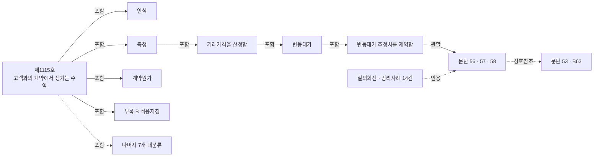
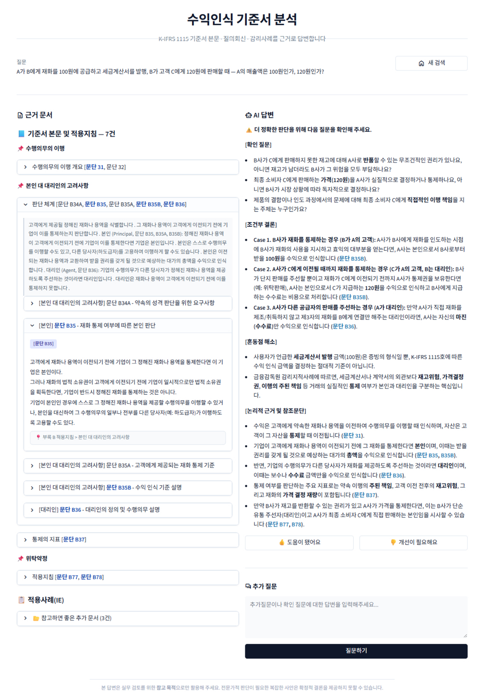
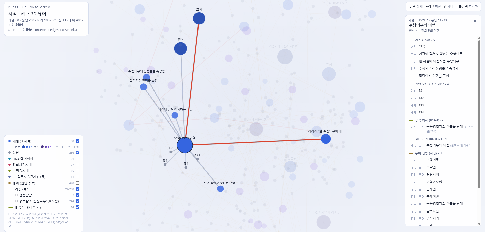
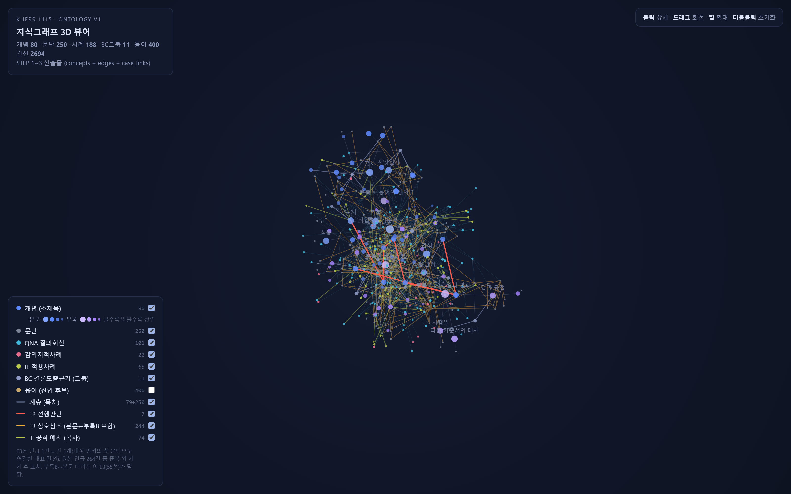

# K-IFRS 1115호 챗봇

> **라이브 데모 배포 → http://134.185.104.224:8501/** (Oracle Cloud 배포, Streamlit)

---

## 개요

지식그래프 및 의사결정 트리 기반 K-IFRS 제1115호(수익인식) 챗봇<br>

### 핵심 설계


```mermaid
graph LR
    R["제1115호<br/>고객과의 계약에서 생기는 수익"]
    R -->|포함| T3["인식"]
    R -->|포함| T4["측정"]
    R -->|포함| T5["계약원가"]
    R -->|포함| T8["부록 B 적용지침"]
    R -.->|포함| ETC["나머지 7개 대분류"]

    T4 -->|포함| M1["거래가격을 산정함"]
    M1 -->|포함| M2["변동대가"]
    M2 -->|포함| M3["변동대가 추정치를 제약함"]
    M3 -->|관할| P["문단 56 · 57 · 58"]
    P -.->|상호참조| P2["문단 53 · B63"]
    S["질의회신 · 감리사례 14건"] -.->|인용| P
```
- **지식그래프 기반 검색 시스템 구축**
  - 기준서 목차를 80개의 핵심 개념으로 구조화 (최상위 1, 중간 분류 20, 말단 개념 59)
  - 노드 : 개념 80, 기준서 문단 250, 사례 188(질의회신 101, 감리지적 22, 적용사례 65)
  - 간선 : 포함 79(개념→하위 개념), 관할 250(개념→문단), 상호참조 264(문단→문단), 인용 663(사례→문단)
  - 기준서 원문에 규정된 연결 구조만을 활용함으로써 **범용 LLM 및 유사도 기반 검색의 한계를 보완**

#### 범용 LLM 및 유사도 기반 검색의 한계

- **범용 LLM**
  - 답변 검증의 어려움 : 기준서 근거 조문 및 관련 사례 추적 불가
  - 환각 답변 생성 위험 : 기준서에 명시되지 않은 판단을 통해 답변할 위험 
  - 2종 오류 발생 위험 : 틀린 답변을 사실처럼 출력할 위험

- **단순 유사도 기반 검색 RAG**
  - 유사도   : 임베딩은 "2024"와 "2025"를 거의 같은 것으로 보지만, 회계 판단은 숫자 한 자리·조건 하나로 결론이 갈림
  - 상호참조를 따라가지 못함 : "제N문단 참조"가 적힌 조문은 회수해도, 정작 그 참조가 가리키는 조문은 질의와 안 닮아 누락
  - 청킹이 위계를 끊음 : 목차·절·항의 계층과 본문–부록 대응이 분할 과정에서 사라져, 조문이 맥락에서 떨어진 채 전달
  - 조정 수단이 상수뿐 : 결과가 어긋나도 임계값·가중치를 만지는 것 외에 고칠 방법이 없고, 그 값의 근거를 설명할 수 없음

### RAG 처리 프로세스

```
   사용자 질의
       │
 ━━━ 다단계 Retrieval 진입 ━━━
       │
       ├─ 4단계 절차 → 진입 개념 확정
       └─ 지식그래프 확장 ─┬─ 관할 → 기준서 문단 → 상호참조 → 이웃 문단
                          └─ 인용 → 질의회신, 감리사례
       │
       ▼
 ━━━ 의사결정 트리 활용 ━━━
       │
       ├─ 기준서 원문의 조건부 판단 분기 준수
       └─ LLM 자의적 추론 통제
       │
       ▼
 ━━━ PydanticAI 기반 출력 제어 ━━━
       │
       ├─ 필수 조문 인용 및 형식 검증
       └─ 조건 미달 시 반려 및 재생성
        │
        ▼
   근거 문서 + 구조화된 답변
```

1. **다단계 Retrieval 진입 방식**
  - 기준서 문단 250개를 핵심 개념 80개에 배정(지식그래프 기반)
  - 앞 단계가 앞자리, 뒤 단계는 후순위 병합 → 보조 신호가 핵심 문단을 밀어내지 않음

<details>
<summary><b>진입 4단계 — LLM 지목 · 위계 확장 · 사전 조회 · 코사인 보조</b></summary>

- **1단계** : LLM이 질의와 관련된 개념을 지목
- **2단계** : 지목된 개념의 상위·형제 개념을 포함 간선으로 확장
- **3단계** : 실무 용어와 기준서 개념을 연계한 사전 조회

  ```
  "리베이트"   →  고객에게 지급할 대가  →  문단 70·71·72
  (실무 용어)      (기준서 개념)           (관할 조문)
  ```

- **4단계** : 질의 원문과 개념 80개의 코사인 유사도 상위 3개 선택

</details>

2. **의사결정 트리를 활용하여 자의적 추론 통제**
  - 기준서 원문에 서술된 조건부 판단 로직을 41개의 의사결정 트리로 추출
  - 기준서가 규정한 실제 판단 절차를 준수하도록 설계하여 LLM의 자의적 추론을 통제 
3. **PydanticAI 기반 출력 제어**
  - 출력에 명확한 조문 인용이 없거나 판단 분기를 거치지 않은 답변 반려
  - 최종 출력물을 고정된 형식으로 반환하도록 강제하여 시스템 답변의 일관성과 가독성을 확보


### 주요 성능 평가 결과

실제 한국회계기준원 질의회신 92건으로 구성된 홀드아웃 테스트 셋을 활용하여 성능을 검증

| 평가 지표                | 측정 결과                                                     |
| ------------------------ | ------------------------------------------------------------- |
| 질의회신 결론 재현율     | **80/92**       -> 퍼센트로                                   |
| 지식그래프 데이터 무결성 | 기준서 원문 누락 없음, 연결이 안된 문단 0, 연결이 안된 노드 0 |

결론 재현에 실패한 12건의 사례는 유형별로 분류하여 §7에 기술 <- 단락 표현 제대로

### 평가 결과 해석 및 통제 조건

- **객관적 외부 채점 기준 활용**
  92건은 한국회계기준원이 공식 공표한 실제 질의회신으로 구성

- **데이터 자가 참조 차단**
  평가 데이터 원문을 검색 인덱스 대상에서 배제한 상태로 테스트를 진행

- **단일 실행 기반 측정 및 변동성의 불가피성** <- 아예 뺴던지, 아니면 장점으로 어필을 하던지 
  제시된 재현율(80/92)은 1회 실행을 기준으로 산출된 결과
  최초 진입 경로 판단과 답변 생성 단계에 LLM이 개입하므로 확률적 변동이 필연적으로 발생
  temperature 0과 seed 고정으로도 동일 결과가 보장되지 않음을 확인 — 구조로 줄일 수는 있으나 LLM을 쓰는 한 변동성 완전 제거는 불가

### K-IFRS 제1115호 선정 배경 <- #1로 빼기?

- **질의회신 및 감리지적사례 최다 발생**
  - 제1115호 관련 사례는 총 123건(질의회신 101건, 감리지적사례 22건)
  - 전체 기준서 중 가장 높은 수치를 기록
  - 한국회계기준원 질의회신 및 금감원 감리지적사례 데이터를 전수 파싱하여 분석

- **알고리즘 구현을 위한 논리 구조의 적합성**
  - 1115호는 조건부 판단 기준이 주제별로 서술되어 있음
  - 5단계 수익인식 모형을 비롯하여 반품권, 재매입약정 등 
  - 기준서의 분기 구조를 바탕으로 총 41개의 판단 트리를 도출

- **개인적 동기**
  수험 과정 중 수익 인식 파트의 사례 판단 유형에서 어려움을 겪음 → 복잡한 거래 사례의 결론이 기준서 내 어느 조문에 근거하는지 직관적으로 추적하고 검증할 수 있는 보조 도구의 필요성을 체감

### 구성 요소 및 데이터 구축 규모 <- 맨밑으로뺌?

| 구성 요소                     | 단위: (개/건)                              |
| ----------------------------- | ------------------------------------------ |
| 개념 노드 · 위계 간선         | 80 · 79                                    |
| 기준서 문단                   | 250                                        |
| 문단 상호참조                 | 264                                        |
| 조건 분기 판단트리            | 41                                         |
| 실무어 사전                   | 423                                        |
| 연결된 사례 데이터            | 질의회신 101 · 감리지적 22 · 적용사례IE 65 |
| 사례-기준서 조문 간 인용 연결 | 663                                        |

### 실제 사용 스크린샷 

> **사용자 질문 —** A가 B에게 재화를 100원에 공급하고 세금계산서를 발행, B가 고객 C에게 120원에 판매할 때, A의 매출액은 100원이야 120원이야?

<p align="center">
  
</p>
<p align="center"><sub>좌측은 기준서 근거 문서, 우측은 AI 판단 - 조건에 따라 Case 1·2·3로 분기하고 각 분기에 문단 인용</sub></p>

---

## 1. 문제 인식 

### 범용 LLM 한계와 본 시스템의 해결 방안

| 구분      | 범용 LLM                              | 본 시스템                                                                                                      |
| --------- | ------------------------------------- | -------------------------------------------------------------------------------------------------------------- |
| 근거 추적 | 블랙박스 형태(조문 추적 어려움)       | 지식 그래프 기반 개념→문단→사례 추적 근거 제시                                                                 |
| 재현성    | 동일한 질문에 매번 다른 답            | 그래프 순회가 결정적 — 같은 개념으로 진입하면 같은 문단이 나옴 (진입 판단·최종 생성은 LLM이라 변동 여지 · §10) |
| 판단 출처 | 기준서에 없는 판단을 지어낼 위험      | 사전 정의된 판단트리로 추론 절차 통제                                                                          |
| 환각 위험 | 그럴듯한 오답 생성(**2종 오류 위험**) | 근거 부족이라고 명확히 응답                                                                                    |

### 회계감사의 핵심 리스크: 2종 오류

잘못된 정보를 사실처럼 제시하는 것이 훨씬 큰 비용 초래

| 오류     | 정의                                            | 위험도                          |
| -------- | ----------------------------------------------- | ------------------------------- |
| 1종 오류 | 근거가 존재함에도 찾지 못해 "모른다"고 응답     | 낮음 — 추가 검색으로 보완가능   |
| 2종 오류 | 근거가 없거나 틀린 내용을 확신에 찬 어조로 답변 | **치명적** — 큰 비용으로 이어짐 |

본 파이프라인은 2종 오류의 최소화에 초점을 맞추고 있음
- 통제된 답변: 근거 없는 확정적 답변 생성을 구조적으로 차단
- 엄격한 판단: 기준서에 명시된 확실한 조건에서만 결론을 도출
- 유보적 접근: 내용이 모호하거나 교차 검증이 필요한 경우 조문만 제시하고 최종 판단을 유보

---

## 2. 실증 예시

**질문**(QNA-2017-I-KAQ015-Q1) : 아파트 분양계약으로 고객이 1차 중도금 납부 전엔 해제 가능(위약금 분양대금의 10%), 이후엔 해제불가. 이때 회사가 수행완료분에 대한 집행 가능한 지급청구권을 가져 진행기준을 적용할 수 있는가

  1. analyze (gpt-4.1-mini)
  - 판별1 : 이 질문이 수익인식 기준(1115호) 안의 것인지(→ 맞음)
  - 판별2 : 금액을 계산? 회계추론? (→ 회계추론)
  - 판별3 : 질문에 걸린 용어판별 → 지식그래프의 개념 6개(계약 식별·대체용도 없는 자산·지급청구권·변동대가 등)로 연결
  2. retrieve 
  - 개념 6개 각각의 기준서 문단 → 참조하는 이웃 문단 → 관련 사례를 그래프를 따라 retrieve(총 문서 159개)
  3. generate 
  - 기준서를 따라 미리 만들어둔 의사결정나무(문단 35·37·B9·B11)에 주입되어 답변이 분기됨
    - Case 1 — 중도금 전 공정진행률이 10% 미만이면 → 지급청구권을 인정, 진행기준(문단 35·B9)
    - Case 2 — 공정진행률이 10%를 넘는 시점이 있으면 → 그 시점엔 권리가 약해 인도기준(문단 37·B12)
  4. format
  - 인용 없으면 답 없음 
  - 분기 라벨을 필드로 강제 : 답을 산문으로 뽑지 않고 구조적으로 강제
  - 환각 필터 : 실제 컨텍스트에 있던 키만 통과, 없는 사례번호는 걸러짐

---

## 3. 기술 설명 ① 진입점 — 용어사전 

```
 ━━━ [1] analyze : LLM(gpt-4.1-mini) 1회 호출 — 질문 + 멀티턴 구성(최근3턴) ━━━


    ◆ 패스스루 축   →  뒤 노드(generate/format)로 전달
      needs_calculation  ┳ true  = 계산      → gpt-4.1-mini
                         ┗ false = 회계추론  → Gemini Flash
      is_situation       계약당사자, 거래조건, 계약구조 중 2개 이상 존재 → generate clarify(꼬리질문) 분기
                         1개인 경우 → 단순 기준서 찾아주기
      complexity         답이 하나로 정해지는지?  →  simple / complex   → Gemini thinking_level (low / medium)
      confusion_point    사용자 오해 원인(LLM추론)    → clarify 프롬프트 주입(오해 교정)
      provided_info      질문에서 이미 명시한 판단요소  → clarify 재질문 방지

    ◆ 개념 진입 축   →  analyze[2]~[5]로 전달
      topic_hints       최대 3개 · 거래 실질상 쟁점이면 지목(고정 35토픽 중 개념 매핑 보유 33개가 실효 진입)
      standalone_query  멀티턴 재구성 — 회사명·금액 제거(추상화) → 1115호 공식용어로 번역(정규화)
                    
    ◆ 게이트
      routing (1115호 IN / OUT)    
          │ 
          ├── routing = OUT ──▶ 범위 밖 거절 · 파이프라인 종료
          ▼   routing = IN , scope guard : routing=IN 이어도 타기준서 전용어만 존재하고, 1115호 앵커(수행의무·거래가격…)가 없으면 다시 OUT
  ━━━ 개념 진입 ━━━

    [2] topic_hints → 개념   (_resolve_topic_hint)
          topic_map - "수행의무 식별" → "수행의무" 부분매칭 흡수
          → via_topic 확정
          ※ via_topic = "결정적 신호" : retrieve의 케이스·IE, generate의 판단트리 선택 한정
          │
          ▼
    [3] subtree 확장   (_adaptive_subtree)
          via_topic 개념의 형제·하위 개념을 뒤에 붙임 (2순위 · gap 보강)
          부모 하위트리(자기 제외) ≤ 8(subtree_expand_max) → 형제 포함 / 그보다 크면 → 자기 하위만(문단 폭발억제)
          │
          ▼
    [4] 용어사전 조회   (resolve_terms)
          입력 = standalone_query (없으면 사용자 원문)
          aliases 용어(파일 423 · 매칭 인덱스 400) 중 입력에 substring으로 걸린 것 → 그 용어의 개념·사례 회수 (LLM 무관)
          │
          ▼
    [5] concept_ids 확정
          1순위(via_topic) → 2순위(subtree) → 3순위(용어사전) 순서로 병합 · 중복 제거
          ※ 개념 순서 = 문단 우선순위 (traverse가 개념 순서대로 문단을 채움 → 질문 주제 문단이 앞자리)
          → retrieve 노드로 넘김 (via_topic · entry_cases 동반)
```
### 용어 사전 구축 방식

1. 초안 생성 (GPT o4-mini)
- 자주 쓰이는 말(판매장려금·리베이트·풋옵션…)을 GPT(o4-mini)로 1115호 공식용어 2~4개에 매핑
- 수익인식,거래가격와 같은 범용어에는 매핑되지 않도록 규칙 → 실무어 사전 초안 288개

2. 지식그래프 생성 후 - 용어사전 조립
- ① 진입 어휘 확정
  - 초안 288개 + 사례 제목 123개(질의회신·감리지적사례의 제목) + 부록A 공식 정의 9개
  - 아이템,항공과 같은 단독으로 진입하지 못할 단어들은 제외 
- ② 개념에 연결
  - 각 단어를 그래프 개념에 글자 비교로 자동 연결. (오타·조사 차이 허용 → 대리인 = 본인 대 대리인의 고려사항)
  - 애매한 단어 78개 AI가 → 근거 문단을 보고 판단(그대로 채택 41·손봄 34·사용자 직접 결정3(시상품·아이템·항공))
- ③ 사각지대 보완
  - 단어들이 실제 개념까지 연결되는지 전수 점검 
  - 연결이 부실한 항목 확인 및 본문을 근거로 보완

---

## 4. 기술 설명 ② RAG — 지식그래프

기준서의 명시적 위계 관계를 노드·간선으로 옮긴 지식그래프

```
                     거래가격을 산정함        ← ① 위 : 부모 개념
                           │  (부모–자식)
                           ▼
                     
                        변동대가     ─── ② 옆 : 형제 개념 3개
                           ┬              (유의적 금융요소 · 비현금대가 · 고객에 지급할 대가)
          ┌────────────────┼────────────────┬────────────────┐
          ▼                ▼                ▼                ▼
     ③ 아래: 자식      ④ 자기 원문        ⑤ 사례           ⑥ 배경(BC)
     환불부채          관할 문단          이 개념을         "왜 변동대가를
     ·제약·재검토      50·51·52·53·54     다룬 QNA·지적사례   제약하나"
                          │
                          └─ ⑦ 문단끼리 "○문단 참조" (상호참조)

변동대가 하나가 이렇게 8~10개와 이어지고, 개념 80개가 다 이렇게 얽히면
→ 3D 뷰어에 그려지는 선 2,694개 (용어→개념 755선 포함 · 아래 표와는 집계 단위가 다름)
```
1. 개념 위계는 AI 판단 없이 기준서 본문 구조로만 구성됨
  - 개념 노드와 그 상하관계(부모–자식)는 기준서의 목차·소제목 위계 "어느 개념이
  - 개념 80개 · 계층 간선 79개 · 관할 문단 250개 배정
2. QNA·감리 사례는 문단으로 1차 연결 → 제목으로 보강
  - 문단 인용이 약하거나 없는 사례→ 제목 자체를 용어사전 별칭으로 등재(123건)해 "제목 → 개념" 진입
  - 문단 인용이 0인 6건은 질의 원문 근거로 개념에 직접 연결

### 관계 종류

| 무엇 ↔ 무엇      | 관계       |    개수 | 쉬운 뜻                                |
| ---------------- | ---------- | ------: | -------------------------------------- |
| 개념 ↔ 개념      | 계층       |      79 | 큰 주제 밑 작은 주제 (부모–자식)       |
| 개념 ↔ 개념      | 5단계 순서 |       7 | 먼저 판단 → 나중 판단 (수익인식 5단계) |
| 개념 → 문단      | 관할       |     250 | 이 개념이 담당하는 원문                |
| 문단 ↔ 문단      | 상호참조   |     264 | 원문의 "제N문단 참조"                  |
| 문단 ↔ 부록B     | 대응       |       3 | 본문 규정 ↔ 적용지침                   |
| 사례 → 문단·개념 | 인용       |   1,220 | 이 사례가 다룬 규정                    |
| BC → 문단·개념   | 배경       | 446·516 | "왜 이 규정을 만들었나"                |
| 사례 → BC        | 배경       |      59 | 이 사례의 취지 근거                    |

### 완전성 검증

생성 원칙 : "제N문단 참조"를 정규식으로 추출
- **전 규범 문단(본문·부록B·부록C 247개)에 같은 정규식을 독립 재적용**해 대조하는 census로 검증
  - census = 전수 대조. 검사 대상 분모를 스크립트로 다시 뽑아 그래프와의 차집합이 0인지 본다
- 검사 범위는 **결정론으로 확인 가능한 완전성**
- 의미적 완전성까지 검사로 파악할 수는 없음

| census 축     | 결과  | 뜻                                   |
| ------------- | :---: | ------------------------------------ |
| 상호참조 누락 | **0** | 원문이 그은 참조 중 그래프 누락 없음 |
| 참조 도달성   | **0** | 인용 문단은 전부 개념으로 진입 가능  |
| 고아 문단     | **0** | 관할 개념 없는 규범 문단 없음        |

### 범위 한계 — GraphRAG가 아니라 지식그래프 기반 검색

그래프를 검색 경로로 쓰지만 **GraphRAG**는 아님.

시도한 것은 **검색 진입 1순위를 유사도에서 그래프 순회로 옮긴 것**

| 축   | GraphRAG                                | 이 프로젝트                                           |
| ---- | --------------------------------------- | ----------------------------------------------------- |
| 노드 | 텍스트에서 추출한 엔티티(타입·속성)     | 기준서 문서 구조물 — 목차 소제목 80개 · 문단 · 사례   |
| 간선 | 의미 술어 (제약한다 · 제외한다)         | 구조 관계 — 포함(계층) · 인용(상호참조) · 대응(부록B) |
| 추론 | 커뮤니티 탐지 · 계층 요약 · 엔티티 해소 | 하위 개념군 확장                                      |

<p align="center">
  
</p>
<p align="center"><sub>개념을 클릭하면 관할 문단과 <b>이 개념으로 진입하는 용어들</b>이 펼쳐진다. 용어→개념→문단이 눈으로 이어진다.</sub></p>

<p align="center">
  <a href="https://raw.githack.com/ghdtjrgns321-creator/k-ifrs-1115/develop/graph-3d.html">
    
  </a>
</p>
<p align="center"><sub>전체 간선을 켠 모습. E3 상호참조(노란선)와 E2 선행판단(빨간선)이 개념·문단을 관계로 잇는다.</sub></p>
<p align="center"><sub><b>이미지를 클릭하면 회전·확대·노드 클릭이 가능한 인터랙티브 3D 뷰어로 열립니다.</b></sub></p>

---

## 5. 기술 설명 ③ 판단트리

```
  모든 분기가 기준서 문단을 근거로 생성 — AI 창작 없음

  재매입약정 (문단 B64~B65) — 세 형태로 1차 분기
  │
  ├─【선도 / 콜옵션】  고객이 자산을 통제하지 못함 (B66)
  │     ├─ 재매입가 < 판매가              ─▶ 리스 (제1116호)
  │     ├─ 재매입가 ≥ 판매가              ─▶ 금융약정 (B68 · 자산 계속 인식 + 금융부채, 차액=이자)
  │     └─ 옵션 미행사·소멸               ─▶ 부채 제거 + 수익 인식 (B69)
  │
  └─【풋옵션】  고객의 재매입 경제적 유인이 유의적인가? (B70~B71)
        ├─ 재매입가 < 판매가
        │     ├─ 유인 유의적              ─▶ 리스              
        │     └─ 유인 없음                ─▶ 반품권 판매처럼 (B72 → B20~B27)
        ├─ 재매입가 ≥ 판매가
        │     ├─ 예상 시장가치 초과         ─▶ 금융약정 (B73)
        │     └─ 시장가치 이하 + 유인 없음  ─▶ 반품권 판매처럼 (B74)
        └─ 옵션 미행사·소멸               ─▶ 부채 제거 + 수익 인식 (B76)

  [공통] 판매가·재매입가 비교 시 화폐의 시간가치 고려 (B67 · B75)
```

- 결론은 트리를 타고 도출됨
  - 모든 분기를 기준서 문단을 기준으로 생성 - AI 창작 및 사람이 재구성한 분기 없음
  - LLM이 흩어진 문단에서 판단 순서를 매번 새로 조립하지 않게 하기 위함
- 근거의 충분성 검토
  - 충분하면 → 끝까지 타서 확정 결론
  - 중간에 근거가 끊기면 → 그 분기점에서 Case로 나눠 대답
  - 어느 Case인지 확정하기 위해 무엇을 확인해야 하는지를 함께 제시


---

## 6. 기술 설명 ④ PydanticAI

```python
# 레이어 2 — 출력 스키마 고정
class ClarifyOutput(BaseModel):
    selected_branches: list[str]   = Field(..., description="고른 결론 분기")       # 어느 Case로 결론?
    answer: str                    = Field(..., description="답변 본문(마크다운)")
    cited_paragraphs: list[str]    = Field(..., description="인용 문단 — 비면 거부")  # 근거 필수
    cited_cases: list[str]         = Field(default_factory=list)  # 질의회신·감리 ID
    cited_ie: list[str]            = Field(default_factory=list)  # 적용사례 번호
    follow_up_questions: list[str] = Field(default_factory=list)
    is_conclusion: bool            = Field(default=True)

# 스키마를 에이전트에 물림 → LLM이 이 JSON을 못 채우면 PydanticAI가 자동 재프롬프트
clarify_agent = Agent(gemini_flash, output_type=ClarifyOutput, retries=2, ...)

# 레이어 3·4 — 스키마 통과 뒤 '한 번 더' 검사. 실패하면 ModelRetry로 재생성
@clarify_agent.output_validator
async def _validate(ctx, result: ClarifyOutput) -> ClarifyOutput:
    errors = []
    if not result.cited_paragraphs:              # 레이어 3: 인용 비면 → 다시
        errors.append("근거 문단을 반드시 포함하세요.")
    if not result.selected_branches:
        errors.append("고른 결론 분기를 포함하세요.")
    # 레이어 4: 핵심 사실 미확인인데 확정(분기 1개=TYPE2)이면 → 조건부로 강등 요구
    if len(result.selected_branches) == 1 and _핵심사실_미확인(ctx):
        errors.append("아직 확인 안 된 요소가 있습니다. 조건부(TYPE1)로 바꾸세요.")
    if errors:
        raise ModelRetry("\n".join(errors))      # ← 이 메시지로 LLM에 자동 재요청
    return result
```

### 근거 없는 답 생성 방지 레이어 

| #   | 레이어              | 방지 대상                                             |
| --- | ------------------- | ----------------------------------------------------- |
| 1   | 판단트리(원문 앵커) | 답의 판단 경로를 기준서 문단에 묶어둠                 |
| 2   | 구조화 출력 강제    | "결론 분기 + 인용 문단"을 **반드시 채우는** 형식      |
| 3   | 인용 검증 재시도    | 인용이 비면 **자동으로 다시 생성**                    |
| 4   | 확정→유보 강등      | 핵심 사실이 확인 안 됐는데 단정하면 **조건부로 낮춤** |
| 5   | 사례 직접 주입      | 관련 감리·질의회신 사례를 **강제 배정**               |

---

## 7. 검증

### 검증셋 생성 원칙

실제 질의회신(QNA) 92건 홀드아웃 - 회계기준원 API로 1115호 관련 QNA 수집

```
  qna-parents 101건 (질의자·회계기준원·해석위원회 작성 원문)
        │
        ├─ 쟁점 필터 ──▶ 88건
        │     · 1115호를 "인용만" 하고 실제 쟁점은 타 기준서인 13건 수동 제외
        │       (제1002호 재고·제1032호 금융상품·제1117호 보험 등과 병기된 건)
        │
        ├─ 복수 질문 분리 ──▶ 92건
        │     · 질의1·2가 뭉친 5건을 질문별로 분리 (1건은 위 필터에서 제외 → 실효 +4)
        │
        └─ 힌트 유출 차단 (빌드게이트 4종) ──▶ 최종 테스트셋 92건
              · IFRIC 서술문 → 실무자 1인칭 질문으로 재작성
              · 질문에서 정답 문단번호 제거(개념어로 치환)
              · 회신·결론 문구 유출 차단
              · 문단번호 힌트 잔존 시 빌드 실패

  ── ⭐평가 데이터 격리 통제 2단계 ──────────────────────────

  ① 런타임 시 질의회신 문서 유입 원천 차단              EXCLUDE_QNA=1  (graph_fetch.py:134)
        QNA-접두 사례를 Retrieval 근거에서 배제 → 순환 참조 차단
        기준서 본문 + 판단트리만으로 재현 강제
        └─▶ 결과: 92건 검색결과 중 질의회신 문서 유입 0/92

  ② 온톨로지 인덱스 구축 시 홀드아웃 셋 포함 문제   (미격리 — ⚠️사후 발견으로 수정)
        홀드아웃 92건이 용어 사전(aliases) 및 케이스 링크(case_links) 생성에 반영되는 허점 발견
        → 정답지의 메타데이터가 검색 진입 경로로 누출되는 위험 발생 (문서 제목이 용어로 등재된 84건, 자체 누출 18건)
        └─▶ 사후 처리 : 홀드아웃 셋을 배제한 '정제된 인덱스'를 재빌드→재생성→재채점

```

### 핵심 지표

**채점 방식 — 결론 방향성 LLM 이진 대조**
- QNA에는 회계기준원·해석위원회가 확정한 **정답 결론**이 이미 존재 (이하 `gold` — 채점의 기준이 되는 공식 답)
- 프로젝트 답변이 확정 결론과 같은 방향인지 대조 → LLM에 위임(방향 일치만 판정)
  - **맞음(1)** — 최종 회계 결론·의사결정이 gold와 일치
  - **틀림(0)** — 결론이 다름 / gold가 확정한 사안을 Case 병기로 회피(헤지) / gold가 배제한 경로 / 답변 거부·오류.
- gold 자체가 조건 분기인 문항은 그 분기 구조를 맞게 제시해야 맞음(1)

| 지표                     | 값                 |
| ------------------------ | ------------------ |
| 케이스                   | 질의회신(QNA) 92건 |
| **결론 재현**            | **80/92 (87.0%)**  |
| 질의회신 문서 유입(순환) | 0/92               |
| 실행 에러                | 0/92               |

> **이 값은 1회 실행의 결과다.** 진입 판단이 회차마다 흔들리므로(§10 실측: 3회 모두 같은 진입은 19.3%뿐) 재실행하면 달라질 수 있다. 반복 실행으로 분포를 재지 않았으므로 80/92를 고정값으로 읽으면 안 된다. 인덱스 오염판과의 대조(78/92)는 같은 조건 1회씩이다.

#### 미재현 12건 

- **확정 회피 / 헤지 (4)** — `KQA009-Q1` · `201803A` · `201803B` · `36964`
  - 정답 문단을 **대부분 회수·인용, 방향도 맞음**
  - 결론을 하나로 확정하지 못하고 Case A/B를 병기
  - **원인: "유보적 접근"(애매하면 확정 대신 조문·분기를 제시)의 설계 부작용.** 
  - 정답이 단일 확정을 요구하는 문항에서 유보성이 감점으로 적용된 사례
- **RAG 실패 (1)** — `KQA007` (개별소비세)
  - analyze가 뽑은 토픽('거래가격 산정/배분')이 개별소비세의 정답 프레임(**제3자를 대리해 회수한 금액 → 거래가격에서 제외**)을 못 짚음
  - 정답 개념 일부와 그 관할 문단(8·10·11)을 진입·회수하지 못했음 → 문단 47만 보고 "매출·재고에 포함"이라는 **정반대** 결론
  - 실제 검색 실패
- **generate 오독 / 비결정성 (2)** — `202511019` · `202504C`
  - 정답 문단을 **정확히 회수(105·108 등)했지만** generate가 조항을 오독하거나 과잉해석함
  - LLM 비결정성을 100% 해결하지 못했음
- **타 기준서 정답 (3)** — `202003D`(IAS38 문단69) · `KQA008`(1008호) · `35565`(1038호 문단69)
  - 정답이 1115호 밖이라 이 프로젝트에서는 회수 불가(범위 한계)
- **라우팅 거부 (2)**
  - `KQA006-Q2`(우선매수협상권·통제 이전) — 판매후리스(1116호)와 얽혀 범위 밖으로 판정 - 라우팅 판정 성공
  - `38673`(환불부채) — 질문이 표면적으로 *"제1109호(금융부채)냐 제1037호(충당부채)냐"*로 이루어짐
  -  **1115호의 개념을 한 글자도 언급하지 않음** → LLM이 "타 기준서 질문"으로 오판·거부.
  - 실제 라우팅 실패. **정답 기준서가 질문 표면에 드러나지 않는 함정형**
  - 라우팅의 구조적 취약성을 발견할 수 있었음

---

## 8. 기여 — AI를 어디에 쓰지 않았는가

만든 것은 챗봇이지만, 남은 것은 **회계 도메인 RAG에서 AI를 어디까지 걷어낼 수 있는가**를 한 번 끝까지 밀어본 기록이다.

### 단계별로 무엇을 걷어냈나

| 단계        | 통상적 RAG                 | 이 프로젝트                       | 걷어낸 자리에 넣은 것         |
| ----------- | -------------------------- | --------------------------------- | ----------------------------- |
| 검색 진입   | 쿼리 임베딩 → 유사도 top-k | 용어사전 글자 매칭 → 개념 노드    | 등재 용어 423 · 유사도 후순위 |
| 순위        | 리랭커 + 카테고리 가중치   | 그래프 간선 1홉 순회              | 관할 250 · 상호참조 264       |
| 그래프 뼈대 | LLM이 엔티티·관계를 추출   | 기준서 목차·문단번호 구조         | 개념 80 · 계층 간선 79        |
| 판단 분기   | LLM이 매번 문단에서 조립   | 원문이 서술한 분기를 그대로       | 판단트리 (AI 창작 분기 0)     |
| 남긴 AI     | —                          | 진입 판단 · 별칭 확장 · 최종 생성 | —                             |

정확히는 **dense 임베딩을 1순위 자리에서 내린 것**이지 없앤 것이 아니다. 용어사전 글자 매칭도 lexical 검색 계열이므로, 통상 하이브리드 3축(dense · lexical · graph) 중 순서를 바꾼 구성에 가깝다.

유사도는 진입 후보의 **맨 뒤에 붙는다.** 앞자리를 건드리지 않아 문단 순위가 그대로이고, 글자로 못 찾은 개념만 주워 온다.

### 걷어내서 얻은 것

- **근거 역추적** — 어떤 용어로 들어가 어떤 개념을 거쳐 어떤 문단에 닿았는지가 답변과 함께 나온다
- **그래프 자체의 환각 배제** — 뼈대가 LLM 생성물이 아니라서 근거 경로를 지어낼 여지가 없다
- **오류의 방향 전환** — 못 찾으면 조용히 섞는 대신 범위 밖으로 거절한다 (2종 → 1종)
- **측정된 것** — 홀드아웃 92건 중 결론 재현 80건. 오염판(78건) 대비 무영향이라, 이 성적이 평가셋 누출 덕이 아님을 확인했다

### 걷어내서 잃은 것

- **어휘 불일치** — 등재되지 않은 말로 물으면 글자 매칭이 빈다. 미재현 사례 중 개별소비세(`KQA007`)·환불부채(`38673`)가 그 유형이고, 후순위 유사도 진입은 이 구멍을 완전히는 못 메운다 (§10-5 실측 +1건)
- **확장 비용** — 개념 80 · 용어 423 · 판단트리가 전부 수작업 큐레이션이다 (§10 한계 1)
- **단일 기준서** — 다기준서로 넓히면 용어 충돌과 간선 폭증이 생기며, 그 조건에서도 결정적 진입이 유효한지는 검증하지 않았다

### 같은 방향의 흐름

이 선택이 취향이 아니라 도메인 특성에서 나왔다는 근거로, 같은 문제의식이 2025~2026년 법령·규정 도메인에서 이름을 얻고 있다.

- **structure-aware · deterministic retrieval** — 법령에서는 유효 시점·상위 구조·개정 이력이 관련성을 좌우한다. 더 나은 임베딩이 아니라 구조와 출처를 일급 제약으로 노출하자는 쪽
- **vectorless RAG** — 청킹이 문서의 논리적 위계를 파괴한다는 문제 제기. 숫자 한 자리나 괄호 참조가 의미를 바꾸는 도메인에서 특히 치명적이다

감사 전용 어시스턴트를 만드는 회사들이 내세우는 문구도 대체로 "출처 자료 참조 제공"과 "환각 리스크 관리"다. 이 프로젝트가 던진 질문도 다르지 않다.

갈린 것은 그것을 **운영 정책으로 약속할 것인가, 파이프라인 구조로 강제할 것인가**다.

성능 비교는 하지 않는다. 상용 도구는 내부 전용이라 측정할 수 없고, 이 프로젝트도 인용된 문단 번호의 진위까지는 검증하지 못한다.

여기까지가 이 프로젝트가 보인 것이고, 무엇을 아직 못 했는지는 §10에 모아 두었다.

---

## 9. 핵심 의사결정 — 검색 진입부를 왜 갈아엎었나

```
  ━━━ 진입부 3차 전환 · 각 단계는 앞 단계의 결핍 때문에 등장했다 ━━━

    [1] 벡터 임베딩 top-k
          ┗ 결핍 : 일상어 질의와 기준서 원문의 유사도가 낮아 순위가 흔들림
          │
          ▼
    [2] + 카테고리 가중치      본문·QNA·지적사례에 점수를 부여
          ┗ 결핍 : 점수의 근거가 사용자 판단뿐 — 논리 없는 확률값이 최상단을 지배
          │
          ▼
    [3] + Cohere 리랭커        3중 신호(키워드·리랭커·임베딩)로 재정렬
          ┗ 결핍 : 관련 문서를 임계값 미만으로 대량 탈락 · 신호끼리 충돌해 라우팅이 요동
          │
          ▼
    [4] 지식그래프 순회 + 유사도 안전망   ◀ 현재
          기준서가 이미 그어 놓은 연결(목차 위계 · 문단 참조 · 부록B 대응)을 따라감
          유사도는 후보 맨 뒤에 붙어 글자로 못 찾은 개념만 회수 — 앞 순위 불변
          ┗ 남은 결핍 : 진입 판단의 회차 변동 · 후보를 좁히는 축 부재 (§10 한계 4·6)
```

갈아엎은 것은 **진입 1순위**이지 벡터 자체가 아니다. 유사도는 후보 맨 뒤에서 글자로 못 찾은 개념을 줍는 자리로 내려갔다.

초기에는 벡터 임베딩, 가중치 산정, Cohere 리랭커를 결합한 전형적인 RAG 방식을 적용했으나 검색 순위를 결정하는 신호에 명확한 기준이 부재했다.

**가중치 산정의 근거 부재** 
- 근거 없이 사용자의 판단으로만 본문, QNA, 지적사례등에 점수를 부여했음
- 논리적이지 않은 확률값이 검색 결과의 최상단을 지배함

**임베딩 유사도의 높은 변동성** 
- 사용자의 일상어 질의와 기준서 원문 간 유사도 절대값은 0.29~0.47 수준으로 낮았음
- 키워드·LLM(리랭커)·임베딩의 3중 신호가 서로 충돌하면서 동일한 질문에도 라우팅 결과가 달라지는 재현성 없는 검색이 발생
- Cohere 리랭커가 직접 맵핑한 관련 문서 105건 중 103건을 임계값(0.05) 미만으로 판정하여 누락시키는 등의 문제 발생

**결론**
- 이미 회계 기준서는 명시적인 상호 참조 구조(5단계 모형·문단 간 참조·본문과 부록B의 연결)를 가짐
- 단순 유사도와 근거 없는 가중치를 사용한 것이 문제
- 기존의 확률 기반 검색 진입부를 개편하고 비슷한 것을 추측하는 대신 연결된 것을 추출하는 지식 그래프로 전환
- AI와 사람의 개입을 최소화

| 임베딩(유사도)                      | 온톨로지(지식그래프)                     |
| ----------------------------------- | ---------------------------------------- |
| 비슷한 것 위주 유사도 상위 N개 추출 | 기준서 상 명시적 관계 존재               |
| 확률적이고 설명 불가                | 결정적이고 근거를 경로로 제시            |
| 내용 오염으로 인한 환각위험         | 판단 불가 시 검색 실패로 안전하게 드러남 |

### 전환의 근거는 점수가 아니라 결함이었다

① 정당화할 수 없는 가중치 ② 관련 문서 105건 중 103건을 탈락시킨 리랭커 — 둘 다 점수를 재기 전에 이미 고쳐야 할 것이었다.

세 번째였던 재현성은 **해결이 아니라 축소**다. 검색 구간에서 결과를 바꿀 수 있는 단계가 7개에서 0개로 줄었다.

| 검색 구간 (진입 판단 이후 ~ 생성 이전) | 구 시스템 | 현재 |
| -------------------------------------- | :-------: | :--: |
| LLM 호출 (HyDE 가상문서 생성)          |     1     |  0   |
| 연속 점수 순위 (벡터 · BM25)           |     2     |  0   |
| 임의 상수 보정 (윈도 부스팅 · 가중치)  |     2     |  0   |
| 순위 융합 · 외부 재순위 (RRF · 리랭커) |     2     |  0   |

남은 비결정 지점은 진입 판단(analyze) 한 곳이며, 이는 구 시스템에도 있었다. 같은 개념으로 진입하면 이후 순회는 순수 함수라 결과가 같고, 갈렸다면 어디서 갈렸는지 개념 목록으로 특정할 수 있다.

사용자가 체감하는 답변 변동은 여전히 남아 있다(§10 한계 4).

바뀐 뒤에 얻은 것은 정확도 향상이 아니라 **검증 가능성**이다. "원문이 그은 참조 중 그래프가 빠뜨린 것이 없다"(§4 census)는 유사도 검색에서는 쓸 수 없는 문장이다.

---

## 10. 한계점

| #   | 한계                                                    | 성격                                                                                                                                                                                                                                                            |
| --- | ------------------------------------------------------- | --------------------------------------------------------------------------------------------------------------------------------------------------------------------------------------------------------------------------------------------------------------- |
| 1   | **확장성**                                              | 용어사전·판단트리·지식그래프 하나하나 수작업 큐레이션 → 기준서 추가, 개정시 마다 같은 노동 반복, AI 개입 최소화가 장점이자 비용이 됨                                                                                                                            |
| 2   | **자동 버그 검사 시스템 없음**                          | AI 성능을 채점하는 코드만 존재, 코드 수정 시 에러를 자동으로 잡아주는 테스트는 없음(외부 AI에 의존하는 구조의 한계)                                                                                                                                             |
| 3   | **범용 LLM과 정확도 비교 불가**                         | 검증셋 92건이 공개된 회계기준원 질의회신 → 범용 LLM은 공식 결론 학습 가능성 존재                                                                                                                                                                                |
| 4   | **LLM 비결정성 완전 제거 실패**                         | 검색 구간은 순수 함수지만 그 앞의 진입 판단(analyze)과 뒤의 generate가 LLM이라 잔존. 진입 개념이 하나만 달라져도 문단 집합이 통째로 바뀐다(이산 분기라 미세 변동이 증폭됨). 미재현 `202511019`·`202504C`는 정답 문단 정확 회수에도 결론이 틀어졌음. 상세는 아래 |
| 5   | **완전한 GraphRAG 아님**                                | 노드는 기준서 문서 구조물(목차 소제목·문단·사례)이고 간선은 포함·인용 → 엔티티·스키마를 추출 단계 없음. 커뮤니티 요약·엔티티 해소 없음. 시도한 것은 검색 진입 1순위를 유사도에서 그래프 순회로 옮긴 것                                                          |
| 6   | **관련 개념은 검색 가능하지만 그래프가 후보를 못 좁힘** | 관련된 개념이 같은 무게로 LLM에 전달됨. 무엇이 중요한지 고르는 일은 판단트리와 LLM이 대신함.                                                                                                                                                                    |

### 검색 단계가 0인데 왜 답이 흔들리나

"0단계"는 매번 같은 답이 나온다는 뜻이 아니라, **같은 개념으로 진입하면 결과가 같다**는 뜻이다. 흔들림은 검색 구간이 아니라 그 앞에 있다.

첫 화면에서 같은 질문을 세 번 넣으면 회수 문단이 세 번 다 달랐다. 히스토리가 비어 있어 입력은 매번 동일했으므로, 원인은 입력이 아니다.

원인은 진입 판단에 **정답이 여럿인 선택**을 시킨 데 있다. 프롬프트는 35개 토픽 목록에서 "최대 3개"를 고르게 하는데, 위 질문은 수행의무 식별·기간에 걸쳐 vs 한 시점 인식·진행률 측정이 모두 정당한 쟁점이다.

고를 개수도, 무엇을 고를지도 입력만으로 정해지지 않는다.

후보들이 근소하게 갈리는 상태에서는 추론 과정의 미세한 수치 차이가 순위를 뒤집는다. 노이즈가 원인이 아니라 증폭기이며, 후보가 확실히 갈리는 질문에서는 같은 답이 나온다.

- **temperature와 seed로는 잡히지 않는다** — 둘 다 설정했으나 위 3회 실측은 그 상태에서 나온 결과다
- **이산 진입이 차이를 증폭한다** — 주제 힌트가 하나만 바뀌어도 사례·적용지침의 수집 범위와 하위 개념 확장이 통째로 갈린다
- **결정적 경로는 이미 있다** — 용어사전 매칭은 질문 문자열만으로 동작한다. 진입을 얼마나 이 경로에 맡길 수 있는지는 아직 측정하지 않았다

같은 뿌리에서 나온 결함 하나는 수정했다. 하위 개념 확장이 집합을 순회해 프로세스마다 문단 우선순위가 달라지던 문제로, 기준서 목차 순서를 따르는 리스트로 바꿨다.

이것은 결정론 구조의 대가다. 흔들리는 지점을 하나로 줄인 대신, 그 하나가 흔들렸을 때의 진폭은 오히려 커졌다.

유사도 검색이라면 미세한 질의 변화가 순위의 미세한 변화로 남지만, 이산 분기에서는 계단식으로 커진다.

### 흔들림의 크기 — 실측

dev 57건을 3회 반복한 기록(`app/test/qna_holdout/exp_baseline.json`)을 다시 계산했다.

| 무엇을 쟀나                                                  | 값                    |
| ------------------------------------------------------------ | --------------------- |
| **3회 모두 진입 개념 집합이 동일한 케이스**                  | **11/57 (19.3%)**     |
| 정답 개념을 하나라도 잡은 비율 (회차별)                      | 94.7% · 96.5% · 96.5% |
| 정답 개념을 몇 %나 덮었나 (회차별)                           | 79.6% · 81.5% · 78.6% |
| 같은 크기를 무작위 추출했을 때의 기준선                      | 약 36%                |
| 케이스당 정답 개념 2.8개 · 진입 후보 13개 (전체 80개 중 17%) |                       |

읽는 법이 중요하다. **다섯 중 넷은 회차마다 진입이 달라진다.** 그럼에도 정답 개념을 하나라도 잡는 비율은 95% 안팎으로 안정적인데, 넓게 퍼서 들어가기 때문에 어느 주제를 고르든 하위 개념 확장과 용어사전이 대체로 회수하기 때문이다.

다만 이 95%는 관대한 지표다. 정답 개념이 평균 2.8개인데 **하나만 걸려도 성공으로 세고**, 후보를 13개나 넣으므로 무작위 추출로도 36%가 걸린다. 정답 개념을 몇 개나 덮었는지로 엄격하게 재면 **약 80%이며, 다섯 중 하나를 놓친다.**

놓친 개념의 관할 문단은 근거에서 빠진다. 그것이 미재현 사례에서 관찰된 "연결돼 있지만 다른 문단을 인용"과 이어지는지는 아직 대조하지 않았다.

### 이 지표 자체의 한계

정답 개념은 외부에서 주어진 것이 아니다.

```
  질의회신 원문이 인용한 문단 번호        ← 회계기준원·해석위원회 (외부 정답)
            │
            ▼  이 프로젝트의 문단→개념 배정
      정답 개념 집합                      ← 자체 산출물
```

문단 번호는 외부 정답이지만, 그 문단을 어느 개념이 관할하는지는 이 프로젝트의 온톨로지가 정한다. 배정 자체는 기준서 목차 위계에서 결정론적으로 나오고 완전성도 census로 검사했으나(§4), **평가 축을 피평가자가 만들었다는 사실은 남는다.** 독립된 정답 개념표와 대조한 것이 아니다.

### 최신 GraphRAG 기법을 붙이지 않은 이유

한계 5·6의 해법 후보로 검토했으나, 아래 셋은 이 프로젝트의 전제와 충돌해 보류했다.

- **커뮤니티 탐지(Leiden)** — 위계가 없는 LLM 추출 그래프에서 위계를 만들어내는 절차다. 이 그래프는 목차 위계 79간선이 원문에 이미 저작돼 있어 재발견할 대상이 없다
  - 다만 목차를 가로지르는 상호참조 264간선에 한정하면 새 군집이 나올 여지는 있다
- **커뮤니티 사전 요약** — 큰 코퍼스를 압축해야 전부 훑을 수 있을 때 쓰는 도구다. 이 기준서는 본문 전문이 250문단 6.3만 자라 압축할 부피가 없다
  - 인용 대상에서 제외한 탐색 전용 레이어로 두면 "뼈대는 AI 생성물이 아니다"라는 §8 전제와는 충돌하지 않는다. 보류 사유는 전제 충돌이 아니라 규모다
  - 다기준서로 넓히면 코퍼스가 기준서 수만큼 곱해지므로 그 시점에 재검토 대상이 된다
- **상위 노드 자동 집계** — 클러스터링으로 상위 요약 노드를 만드는 기법인데, 이 그래프의 상위 노드(개념 80)는 원문 목차로 이미 저작돼 있다

반대로 이중 레벨 진입(주제 힌트라는 고수준 축 + 용어사전이라는 저수준 축)은 별도로 붙일 것 없이 §3에 이미 구현돼 있다.

### 다음에 할 일

순서가 있다. 아래로 갈수록 앞의 결과에 의존한다.

1. **결론 재현 분포 측정** (미착수) — 80/92는 1회 실행값이다. 3회 반복해 범위로 보고해야 지표와 진입 불안정이 서로 모순되지 않는다
2. **커버리지 결손과 오답의 대조** (미착수) — 정답 개념의 5분의 1을 놓치는 것이 "연결됐지만 다른 문단 인용"으로 이어지는지 확인한다. 이어진다면 진입이 병목이다
3. **진입에서 선택을 제거** (조건부) — 개념 80개를 전부 넣으면 정답 문단은 100% 들어온다. 다만 그것이 성립하는 근거가 본문 전문 6.3만 자라는 규모여서, 다기준서로 넓히면 무효가 된다
4. **그래프 확산 랭킹** (기각) — 진입 개념을 시드로 확산시켜 순위를 매기는 안이었으나, dev 57건에서 현재 순서에 크게 못 미쳤다. 남는 용도는 꼬리 보강뿐이다
5. **어휘 불일치 보완** (구현·측정 완료) — 개념 임베딩을 상시 후순위 진입으로 병합했다. dev 57건에서 정답 개념 포착 54→55건, 커버리지 79.6→83.6%, 문단 순위 지표는 전부 불변이다

3·4·5의 판정 근거는 `app/test/qna_holdout/exp_entry_variance.md`에 실측으로 남겼다.

4번을 기각한 이유는 감쇠율 선택이 아니다. 감쇠율을 0.1~0.9로 전수 스윕해도 현재 순서를 회복하지 못했고, 개념 순서만 목차순으로 바꿔도 성적이 3분의 1로 떨어졌다.

즉 **지금 순위 성능은 그래프 구조가 아니라 진입 개념의 순서, 곧 LLM이 지목한 주제 순서에서 나온다.** 흔들림의 원천과 검색 품질의 원천이 같은 자리라, 흔들림만 떼어내는 처방은 이 셋 모두에서 막혔다.

5번은 한 차례 보류한 이력이 있다. 상시 유사도 진입의 실익이 57건 중 1건에 그쳤기 때문이다(`exp_decision.md`).

재채택의 목적은 성능이 아니라 **어휘 불일치 안전망**이다. 실익 1건이라는 수치는 재측정에서도 그대로였고, 대가는 회수 문단 88.4→99.0개다.

보류 사유 중 "임베딩을 제거했으므로 일관성이 깨진다"는 철회했다. 제거된 것은 개념 벡터 파일 하나였고 임베딩 자산과 생성 경로는 계속 남아 있었다.

---

## 11. 기술 스택

| 레이어          | 기술                          | 비고                                         |
| --------------- | ----------------------------- | -------------------------------------------- |
| 백엔드          | FastAPI + uvicorn             | REST + SSE (`/chat`, `/feedback`, `/health`) |
| 프론트엔드      | Streamlit                     | 근거 선행 UX (좌 근거 문서 / 우 AI 답변)     |
| AI 프레임워크   | PydanticAI                    | 구조화 출력 + result_validator 자동 재시도   |
| 지식 기반       | 온톨로지 JSON + 그래프 코어   | 개념·문단·사례·용어·BC·판단트리              |
| 문서 DB         | MongoDB Atlas                 | 기준서·사례 원문 저장/조회                   |
| LLM (추론)      | Google gemini-3-flash-preview | thinking, 회계 추론 1위                      |
| LLM (분석·산술) | OpenAI gpt-4.1-mini           | analyze · 계산 라우팅(산술 정확도 100%)      |
| 인프라          | Docker · docker-compose · uv  | Python 3.11                                  |

---