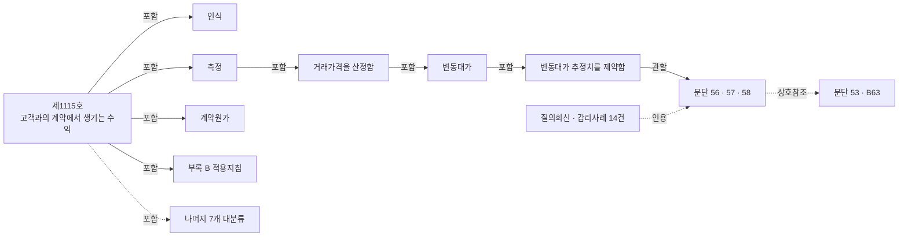
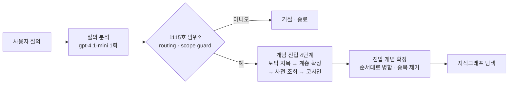
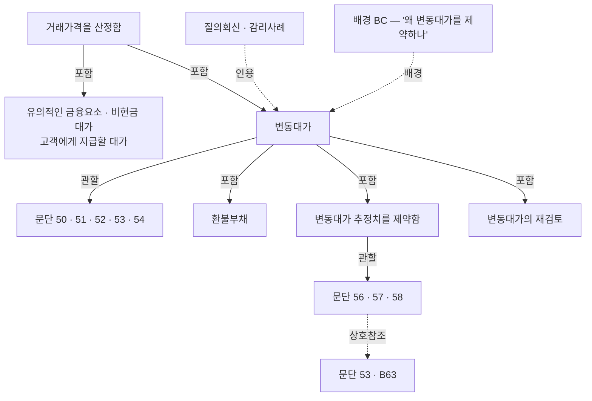

# K-IFRS 1115호 챗봇

> **라이브 데모 배포 → http://134.185.104.224:8501/** (Oracle Cloud 배포, Streamlit)

---

## 개요

### 1. 프로젝트 소개

K-IFRS 제1115호(고객과의 계약에서 생기는 수익) 질의응답을 위한 AI 챗봇

- 수록 문서 ([전체 목록](#수록-문서))
  - 기준서 원문 : 규정 250문단, 결론도출근거(BC) 652문단, 적용사례(IE) 65건
  - 사례 123건 : 질의회신 101건, 감리지적사례 22건
- 핵심 설계
  - 지식그래프 : 기준서의 목차 위계와 문단 간 상호참조 관계를 노드·간선으로 구조화(개념 80개, 문단 250개, 사례 188개)
  - 의사결정 트리 : 기준서 원문의 조건부 판단 기준을 41개의 의사결정 트리 형태로 재구성
- 답변 출력 제어
  - 형식 통제 : PydanticAI를 활용하여 결론, 인용 문단, 참조 사례를 필수 답변 형식으로 지정 (누락 시 재생성)
  - 교차 검증 : 생성된 답변과 판단 근거(조문/사례)를 함께 제공하여 직접 원문 확인 가능 
  - 조건부 답변 : 질의의 사실관계가 불충분한 경우, Case별 결론과 추가 확인 질문 제시

### 2. 문제 인식 및 기준서 선정

#### 범용 LLM 및 유사도 기반 검색의 한계

- **범용 LLM**
  - 답변 검증의 어려움 : 기준서 근거 조문 및 관련 사례 추적 불가
  - 환각 답변 생성 위험 : 기준서에 명시되지 않은 판단을 통해 답변할 위험 
  - 2종 오류 발생 위험 : 틀린 답변을 사실처럼 출력할 위험
- **단순 유사도 기반 검색 RAG**
  - 의미 유사도 한계 : 점수 폭이 좁아 관련 조문과 무관 조문간 구별이 어려움
    ```
      질의 "수익을 기간에 걸쳐 인식하나, 한 시점에 인식하나"
        문단 35 (정답·기간에 걸쳐)   0.44
        문단 38 (정답·한 시점)       0.35
        문단 70 (무관·리베이트)      0.32   ← 문단 38과 0.03 차이
    ```
  - 상호참조 추적 불가 : "문단 B63을 적용한다" 같은 안내 문장 자체를 회수하지만, 실제 B63문단 내용은 회수 하지 못함
  - 문서 위계 구조 소실 : 청킹 과정에서 기준서 목차 위계와 본문–부록 관계 끊김
  - 개선 수단 부재 : 임계값, 가중치 조정 등의 근거가 없음

#### K-IFRS 제1115호 선정 배경

- **질의회신 및 감리지적사례 최다 발생**
  - 제1115호 관련 사례는 총 123건(질의회신 101건, 감리지적사례 22건)
  - 전체 기준서 중 가장 높은 수치를 기록
  - 한국회계기준원 질의회신 및 금감원 감리지적사례 데이터를 전수 파싱하여 분석
- **알고리즘 구현을 위한 논리 구조의 적합성**
  - 1115호는 조건부 판단 기준이 주제별로 서술되어 있음
  - 5단계 수익인식 모형을 비롯하여 반품권, 재매입약정 등 
  - 기준서의 분기 구조를 바탕으로 총 41개의 의사결정 트리를 도출
- **개인적 동기**
  - 수험 과정 중 수익 인식 파트의 사례 판단 유형에서 어려움을 겪음
  - 복잡한 거래 사례의 결론이 기준서 내 어느 조문에 근거하는지 직관적으로 추적하고 검증할 수 있는 보조 도구의 필요성을 체감

### 3. 핵심 설계

#### 지식그래프 기반 데이터 구조화


```mermaid
graph LR
    R["제1115호<br/>고객과의 계약에서 생기는 수익"]
    R -->|포함| T3["인식"]
    R -->|포함| T4["측정"]
    R -->|포함| T5["계약원가"]
    R -->|포함| T8["부록 B 적용지침"]
    R -.->|포함| ETC["나머지 7개 대분류"]

    T4 -->|포함| M1["거래가격을 산정함"]
    M1 -->|포함| M2["변동대가"]
    M2 -->|포함| M3["변동대가 추정치를 제약함"]
    M3 -->|관할| P["문단 56 · 57 · 58"]
    P -.->|상호참조| P2["문단 53 · B63"]
    S["질의회신 · 감리사례 14건"] -.->|인용| P
```
**기준서 본문 및 사례 구조화** (자세한 설명 : [3-2. RAG — 지식그래프](#3-2-기술-설명--rag--지식그래프))
- 기준서 목차를 80개의 핵심 개념으로 구조화 (최상위 1, 중간 분류 20, 말단 개념 59)
- 노드 : 개념 80, 기준서 문단 250, 사례 188(질의회신 101, 감리지적 22, 적용사례 65)
- 간선 : 포함 79(개념→하위 개념), 관할 250(개념→문단), 상호참조 264(문단→문단), 인용 1,220(사례→문단)
- 기준서 원문에 규정된 연결 구조만을 활용 → **범용 LLM 및 유사도 기반 검색의 한계를 보완**

#### 시스템 파이프라인 

```
   사용자 질의
       │
 ━━━ 1. 다단계 Retrieval 진입 ━━━
       │
       ├─ 4단계 절차 → 진입 개념 확정
       └─ 지식그래프 확장 ─┬─ 관할 → 기준서 문단 → 상호참조 → 이웃 문단
       │                  └─ 인용 → 질의회신, 감리사례, 적용사례
       │
       ▼
 ━━━ 2. 의사결정 트리 활용 ━━━
       │
       ├─ 기준서 원문의 조건부 판단 분기 준수
       └─ LLM 자의적 추론 통제
       │
       ▼
 ━━━ 3. PydanticAI 기반 출력 제어 ━━━
       │
       ├─ 필수 조문 인용 및 형식 검증
       └─ 조건 미달 시 반려 및 재생성
        │
        ▼
   근거 문서 + 구조화된 답변
```
1. **다단계 Retrieval 진입 방식**
   - 지목된 개념 전부 LLM에게 전달, 단계의 차이는 LLM이 참조하는 우선순위에만 영향
     (단, 질의회신·감리지적·적용사례 수집은 1단계 지목 개념으로 한정)
   - **1단계** : LLM이 질의와 관련된 개념을 지목
   - **2단계** : 1단계 지목 개념의 부모·형제·하위 개념을 포함 간선으로 확장
   - **3단계** : 실무 용어와 기준서 개념을 연계한 사전(Dictionary) 조회로 개념 지목
     ```
     "리베이트"   →  고객에게 지급할 대가  →  문단 70·71·72
     (실무 용어)      (기준서 개념)           (관할 조문)
     ```
   - **4단계** : 질의 원문과 개념 80개의 코사인 유사도 상위 3개 지목
2. **의사결정 트리를 활용하여 자의적 추론 통제**
   - 기준서 원문에 규정된 조건부 판단 로직을 41개의 의사결정 트리로 추출
   - 실제 판단 절차를 따르므로 LLM의 자의적 추론을 통제
3. **PydanticAI 기반 출력 제어**
   - 출력에 명확한 조문 인용이 없거나 판단 분기를 거치지 않은 답변 반려
   - 최종 출력물을 고정된 형식으로 반환하도록 강제 → 시스템 답변의 일관성과 가독성 확보

### 4. 주요 성능 평가 결과

실제 한국회계기준원 질의회신 92건으로 구성된 홀드아웃 테스트 셋을 활용하여 성능을 검증

| 평가 지표           | 측정 결과          |
| ------------------- | ------------------ |
| 케이스              | 질의회신(QNA) 92건 |
| **결론 재현**       | **85/92 (92.4%)**  |
| 정답 문서 자기 인용 | 0/92(0%)           |
| 실행 에러           | 0/92(0%)           |

결론 재현에 실패한 7건의 사례는 유형별로 분류하여 [미재현 7건 원인 분석](#미재현-7건-원인-분석)에 기술<br>
테스트 셋 선정기준과 홀드아웃 방법은 [테스트셋 생성 원칙](#테스트셋-생성-원칙)에 기술

### 5. 실제 사용 스크린샷 

> **사용자 질문 —** A가 B에게 재화를 100원에 공급하고 세금계산서를 발행, B가 고객 C에게 120원에 판매할 때, A의 매출액은 100원이야 120원이야?

<p align="center">
  
</p>
<p align="center"><sub>좌측은 기준서 근거 문서, 우측은 AI 판단 - 조건에 따라 Case 1·2·3로 분기하고 각 분기에 문단 인용</sub></p>

---

## 목차

1. [문제 인식 및 수록 문서](#1-문제-인식-및-수록-문서)
2. [실증 예시](#2-실증-예시)
3. 기술 설명
   1. [진입점](#3-1-기술-설명--진입점--다단계-개념-진입)
   2. [RAG — 지식그래프](#3-2-기술-설명--rag--지식그래프)
   3. [의사결정 트리](#3-3-기술-설명--의사결정-트리)
   4. [PydanticAI](#3-4-기술-설명--pydanticai)
4. [검증](#4-검증)
5. [핵심 의사결정](#5-핵심-의사결정--거리-기반-rag에서-지식그래프로의-전환)
6. [한계](#6-한계)
7. [기술 스택](#7-기술-스택)

---

## 1. 문제 인식 및 수록 문서

### 범용 LLM 대비 본 프로젝트의 차별점

| 구분      | 범용 LLM                              | 본 시스템                                              |
| --------- | ------------------------------------- | ------------------------------------------------------ |
| 근거 추적 | 블랙박스 형태(조문 추적 어려움)       | 지식 그래프 기반 개념→문단→사례 추적 근거 제시         |
| 재현성    | 동일한 질문에 매번 다른 답            | 진입·생성 LLM 변동은 잔존, 그래프 순회는 LLM 개입 없음 |
| 판단 출처 | 기준서에 없는 판단을 지어낼 위험      | 사전 정의된 의사결정 트리로 추론 절차 통제             |
| 환각 위험 | 그럴듯한 오답 생성(**2종 오류 위험**) | 근거 부족이라고 명확히 응답                            |

### 회계감사의 핵심 리스크: 2종 오류

| 오류     | 정의                             | 위험도                          |
| -------- | -------------------------------- | ------------------------------- |
| 1종 오류 | 근거가 존재하지만 찾지 못함      | 낮음 — 추가 검색으로 보완가능   |
| 2종 오류 | 근거가 없는 내용을 사실처럼 답변 | **치명적** — 큰 비용으로 이어짐 |

본 파이프라인은 2종 오류의 최소화에 초점을 맞춤

- 기준서 기반 : 기준서에 명시된 확실한 조건에서만 결론을 도출
- 통제된 답변 : 근거 없는 확정적 답변 생성을 구조적으로 차단
- 유보적 접근 : 내용이 모호하거나 교차 검증이 필요한 경우 조문만 제시하고 최종 판단을 유보

### 수록 문서

| 문서 구분              | 범위                            |    수량 | 소제목 |
| ---------------------- | ------------------------------- | ------: | -----: |
| 목적                   | 1~4                             |   4문단 |      2 |
| 적용                   | 한4.1                           |   1문단 |      1 |
| 적용범위               | 5~8                             |   4문단 |      1 |
| 인식                   | 9~45                            |  37문단 |     13 |
| 측정                   | 46~90                           |  45문단 |     14 |
| 계약원가               | 91~104                          |  14문단 |      4 |
| 표시                   | 105~109                         |   5문단 |      1 |
| 공시                   | 110~한129.5                     |  25문단 |     12 |
| 부록 A 용어의 정의     | —                               |   1문단 |      1 |
| 부록 B 적용지침        | B1~B89                          |  97문단 |     25 |
| 부록 C 시행일·경과규정 | C1~C10                          |  17문단 |      5 |
| 기준서 규정 소계       | 본문 1\~129 · B1\~B89 · C1\~C10 | 250문단 |     79 |
| 결론도출근거(BC)       | BC1~BC510                       | 652문단 | 21그룹 |
| 적용사례(IE)           | 사례 1~63                       |    65건 |      — |
| 실무 사례              | 질의회신 101 · 감리지적사례 22  |   123건 |      — |

---

## 2. 실증 예시

**질문**(QNA-2017-I-KAQ015-Q1) : 아파트 분양계약으로 고객이 1차 중도금 납부 전엔 해제 가능(위약금 분양대금의 10%), 이후엔 해제불가. 이때 회사가 수행완료분에 대한 집행 가능한 지급청구권을 가져 진행기준을 적용할 수 있는가?

1. **질의 분석 및 개념 진입** (gpt-4.1-mini)
   - 게이트 : 질의가 수익인식 기준(1115호) 범위인지 판별 (→ IN)
   - 라우팅 : 금액 계산인지 회계 추론인지 분류 (→ 회계 추론)
   - 4단계 개념 진입 → 개념 7개 확정
     - 1단계 주제 지목 : 고객의 인수
     - 2단계 위계 확장 : 해당 없음
     - 3단계 용어사전 : 대체 용도가 있는 자산을 만들지 않는다(문단 35⑶) · 변동대가 · 변동대가 추정치를 제약함
     - 4단계 코사인 : 계약을 식별함 · 지금까지 수행을 완료한 부분에 대한 지급청구권 · 기간에 걸쳐 이행하는 수행의무
2. **지식그래프 확장**
   - 개념 7개의 관할 문단 → 상호참조 이웃 문단 → 인용 사례 순으로 수집 (문서 38개)
3. **의사결정 트리 활용**
   - 1에서 진입된 개념이 순차대로 트리에 주입
     - 1. 고객의 인수 ← `고객의 인수` (1단계)
     - 2. **기간에 걸쳐 vs 한 시점 인식** ← `대체 용도가 있는 자산을 만들지 않는다(35⑶)` (3단계)
     - 3. 변동대가(추정) ← `변동대가` (3단계)
     - 4. 변동대가 제약 ← `변동대가 추정치를 제약함` (3단계)
     - 5. 계약의 식별(5요건) ← `계약을 식별함` (4단계)
   - 트리가 요구하는 분기(위약금이 "원가 + 적정이윤"에 해당하는가)가 질의문에 없어 확인 질문형태로 답변
     - Case 1 — 위약금 10%가 수행 완료분 보상을 충족 → **기간에 걸쳐** 인식 (문단 35)
     - Case 2 — 미달하여 전 기간 지급청구권 요건 불충족 → **한 시점**에 인식 (문단 38)
   - 인용 문단 35·37·38·B9·B11 (정답 문단 9·32·35·37·B9·B11·B12)
4. **PydanticAI 기반 출력 제어**
   - 필수 조문 인용 검증 : 인용이 없으면 재생성을 요구(재시도 소진 시 일반 생성 경로로 폴백)
   - 판단 분기 라벨을 필드로 강제 : 답을 산문으로 뽑지 않고 구조적으로 반환
   - 환각 필터 : 실제 컨텍스트에 있던 키만 통과, 없는 사례번호는 걸러짐

---

## 3-1. 기술 설명 : 진입점 — 다단계 개념 진입

> **실제 구현** — [`analyze.py`](app/nodes/analyze.py) · [`graph.py`](app/domain/graph.py)


```mermaid
graph LR
    Q["사용자 질의"] --> A["질의 분석<br/>gpt-4.1-mini 1회"]
    A --> G{"1115호 범위?<br/>routing · scope guard"}
    G -->|아니오| STOP["거절 · 종료"]
    G -->|예| E["개념 진입 4단계<br/>토픽 지목 → 계층 확장<br/>→ 사전 조회 → 코사인"]
    E --> M["진입 개념 확정<br/>순서대로 병합 · 중복 제거"]
    M --> R["지식그래프 탐색"]
```

### 질의 분석 계층 

| 추출 필드           | 판정 기준                             | 목적                                         |
| ------------------- | ------------------------------------- | -------------------------------------------- |
| `routing`           | 1115호 IN / OUT                       | OUT이면 파이프라인 종료                      |
| scope guard         | 질의 내 1115호 핵심 단어 부재         | routing=IN이어도 다시 OUT(오분류 방어)       |
| `needs_calculation` | 계산 / 회계추론                       | 생성 모델 분류 — gpt-4.1-mini / Gemini Flash |
| `is_situation`      | 복합 쟁점 / 단순 조문 검색            | clarify(꼬리질문) 분기 / 단순 조문 안내      |
| `confusion_point`   | 질의에 포함된 사용자 오해의 원인 식별 | clarify 프롬프트에 주입해 오해 교정          |
| `provided_info`     | 질문에 이미 포함된 판단요소           | 재질문 방지                                  |
| `standalone_query`  | 회사명 제거, 1115호 공식용어로 번역   | 3단계 용어사전 입력                          |

### 개념 진입 4단계

| 단계      | 개념 탐색 방법                                         | 세부사항                                                                 |
| --------- | ------------------------------------------------------ | ------------------------------------------------------------------------ |
| **1단계** | LLM이 질의의 핵심 토픽 지목                            | 사전 정의된 주제 목록에서 선택 → 상위 개념에 매핑                        |
| **2단계** | 계층 간선을 통한 확장                                  | 1단계 식별 노드의 계층 간선(부모·형제·자식)을 따라 탐색망 확장           |
| **3단계** | 실무 용어와 기준서 개념을 연계한 사전 조회로 개념 지목 | "리베이트" → 고객에게 지급할 대가                                        |
| **4단계** | 코사인 유사도 상위 3개 지목                            | 임계값·가중치 없이 순위만 사용, 후보 최하단에 추가하여 보조적으로만 사용 |

### 용어 사전 구축 방식

1. 초안 생성 (GPT o4-mini)
   - GPT(o4-mini)로 자주 쓰이는 말(판매장려금·리베이트·풋옵션…)을 1115호 공식용어 2~4개에 매핑
   - 수익인식,거래가격와 같은 범용어에는 매핑되지 않도록 규칙 → 사전 초안 288개
2. 사전 확장
   - 진입 어휘 확정
     - 초안 288개 + 사례 제목 132개(질의회신·감리지적사례의 제목) + 부록A 공식 정의 9개
   - 개념에 연결
     - 각 단어를 그래프 개념에 연결
     - 애매한 단어 78개 → 본문을 보고 수동연결
   - 사각지대 보완
     - 단어와 개념이 전수로 연결되는지 확인
     - 연결이 부실한 항목들은 본문을 근거로 보완

---

## 3-2. 기술 설명 : RAG — 지식그래프

기준서의 위계 관계를 노드·간선으로 옮긴 지식그래프

> **실제 구현**
> - 탐색 코드 : [`graph.py`](app/domain/graph.py) — [`resolve_question`](app/domain/graph.py#L222) · [`traverse`](app/domain/graph.py#L268)
> - 빌드 스크립트 : [`14~20-ontology-*.py`](app/preprocessing)
> - 산출 데이터 : [`data/ontology/`](data/ontology)


```mermaid
graph TD
    P["거래가격을 산정함"]
    B["유의적인 금융요소 · 비현금 대가<br/>고객에게 지급할 대가"]
    V["변동대가"]
    P -->|포함| V
    P -->|포함| B
    V -->|관할| VP["문단 50 · 51 · 52 · 53 · 54"]
    V -->|포함| C1["환불부채"]
    V -->|포함| C2["변동대가 추정치를 제약함"]
    V -->|포함| C3["변동대가의 재검토"]
    C2 -->|관할| CP["문단 56 · 57 · 58"]
    CP -.->|상호참조| X["문단 53 · B63"]
    S["질의회신 · 감리사례"] -.->|인용| V
    BC["배경 BC — '왜 변동대가를 제약하나'"] -.->|배경| V
```
- 구성 방법
  - 기준서 원문의 목차 및 소제목 계층 구조 차용
  - 개념 노드 80개, 관할 문단 250개 등 모두 매핑
- 질의회신·감리지적 연결 방법
  - 1차적으로 기준서 문단 인용을 기준으로 연결
  - 문단 인용이 미흡한 사례(132건) : 사례의 제목을 활용하여 연결성을 보강
  - 조문 인용이 없는 사례(6건) : 질의 원문을 근거로 핵심 개념에 직접 매핑

### 구성 요소 및 규모

| 구성 요소 | 규모 및 특징                                                             |
| --------- | ------------------------------------------------------------------------ |
| 개념 노드 | 80개 (하위문단 없는 중간 계층 노드 3개 포함)                             |
| 관할 문단 | 250개 (개념 노드 종속 문단)                                              |
| 사례      | 총 188개 (질의회신 101건, 감리사례 22건,적용사례(IE) 65건)               |
| 예외 처리 | 8건 (질의회신 6건,적용사례 2건) → 인용 조문이 없어 개념 노드에 직접 매핑 |
| 용어사전  | 용어 423개                                                               |

### 관계 정의

| 연결 노드        | 관계 유형(Edge) |    개수 | 세부 의미                                               |
| ---------------- | --------------- | ------: | ------------------------------------------------------- |
| 개념 ↔ 개념      | 계층            |      79 | 상·하위 주제 간 종속 관계 (부모-자식)                   |
| 개념 ↔ 개념      | 5단계 순서      |       7 | 수익인식 5단계 모형 선후 흐름                           |
| 개념 → 문단      | 관할            |     250 | 개념이 규정하는 문단                                    |
| 문단 ↔ 문단      | 상호참조        |     264 | 타 문단 인용 ("제N문단 참조")                           |
| 문단 ↔ 부록B     | 대응            |       3 | 본문과 부록(적용지침) 간 연계                           |
| 사례 → 문단·개념 | 인용            |   1,294 | 사례가 판단 근거로 삼은 규정 (문단 1,220건 · 개념 74건) |
| BC → 문단·개념   | 배경            | 446·516 | 제정 취지 (기준서 본문)                                 |
| 사례 → BC        | 배경            |      59 | 사례 판단 (기준서 본문)                                 |
| 용어 → 개념      | 진입            |     606 | 실무 용어에서 개념으로 들어오는 경로                    |

### 구조 검증

| 검증 지표     | 결과  | 세부 의미                             |
| ------------- | :---: | ------------------------------------- |
| 상호참조 누락 | **0** | 원문에 기재된 상호참조 경로 100% 매핑 |
| 도달 불가     | **0** | 모든 문단이 전부 개념으로 진입 가능   |
| 고립 문단     | **0** | 단절되어 홀로 존재하는 문단 없음      |

<p align="center">
  
</p>
<p align="center"><sub>개념을 클릭하면 관할 문단과 <b>이 개념으로 진입하는 용어들</b>이 펼쳐진다. 용어→개념→문단이 눈으로 이어진다.</sub></p>

<p align="center">
  <a href="https://raw.githack.com/ghdtjrgns321-creator/k-ifrs-1115/develop/graph-3d.html">
    
  </a>
</p>
<p align="center"><sub>전체 간선을 켠 모습. E3 상호참조(노란선)와 E2 선행판단(빨간선)이 개념·문단을 관계로 잇는다.</sub></p>
<p align="center"><sub><b>이미지를 클릭하면 회전·확대·노드 클릭이 가능한 인터랙티브 3D 뷰어로 열립니다.</b></sub></p>

---

## 3-3. 기술 설명 : 의사결정 트리

> **실제 구현**
> - 매칭 코드 : [`graph.py`](app/domain/graph.py) — [`match_judgment_tree`](app/domain/graph.py#L154)
> - 주입 지점 : [`generate.py`](app/nodes/generate.py#L99)
> - 원천 데이터 : [`judgment_trees.json`](data/ontology/judgment_trees.json)

```
  기준서 문단을 근거로 분기 생성 

  재매입약정 (문단 B64~B65) — 1차 분기
  │
  ├─【선도 / 콜옵션】  고객이 자산을 통제하지 못함 (B66)
  │     ├─ 재매입가 < 판매가              ─▶ 리스 (제1116호)
  │     ├─ 재매입가 ≥ 판매가              ─▶ 금융약정 (B68 · 자산 계속 인식 + 금융부채, 차액=이자)
  │     └─ 옵션 미행사·소멸               ─▶ 부채 제거 + 수익 인식 (B69)
  │
  └─【풋옵션】  고객의 재매입 경제적 유인이 유의적? (B70~B71)
        ├─ 재매입가 < 판매가
        │     ├─ 유인 유의적              ─▶ 리스              
        │     └─ 유인 없음                ─▶ 반품권이 있는 판매 준용 (B72 → B20~B27)
        ├─ 재매입가 ≥ 판매가
        │     ├─ 예상 시장가치 초과         ─▶ 금융약정 (B73)
        │     └─ 시장가치 이하 + 유인 없음  ─▶ 반품권이 있는 판매 준용 (B74)
        └─ 옵션 미행사·소멸               ─▶ 부채 제거 + 수익 인식 (B76)

  [공통] 판매가·재매입가 비교 시 화폐의 시간가치 고려 (B67 · B75)

```
- 트리 설계 및 매핑
  - 모든 분기점은 기준서 원문만을 기준으로 구성
  - 다단계 Retrieval 탐색에서 회수된 모든 개념의 관할 트리를 전량 주입
- 결론 제시 방법
  - 확정 결론: 질의 내 사실관계가 충분하여 트리의 끝단까지 도달
  - 조건부 분기(Case): 정보 부족으로 트리의 중간에서 판단이 끊김 → Case별 정답을 제시, 결론 확정에 필요한 추가 확인 사항 질문

---

## 3-4. 기술 설명 : PydanticAI

> **실제 구현** — [`agents.py`](app/agents.py) : [`ClarifyOutput`](app/agents.py#L135) · [`clarify_agent`](app/agents.py#L248) · [`output_validator`](app/agents.py#L301)

```python
# 레이어 2 — 출력 스키마 고정
class ClarifyOutput(BaseModel):
    selected_branches: list[str]   = Field(..., description="고른 결론 분기")       # 어느 Case로 결론?
    answer: str                    = Field(..., description="답변 본문(마크다운)")
    cited_paragraphs: list[str]    = Field(..., description="인용 문단 — 비면 거부")  # 근거 필수
    cited_cases: list[str]         = Field(default_factory=list)  # 질의회신·감리 ID
    cited_ie: list[str]            = Field(default_factory=list)  # 적용사례 번호
    follow_up_questions: list[str] = Field(default_factory=list)
    is_conclusion: bool            = Field(default=True)

# 스키마를 에이전트에 물림 → LLM이 이 JSON을 못 채우면 PydanticAI가 자동 재프롬프트
clarify_agent = Agent(gemini_flash, output_type=ClarifyOutput, retries=2, ...)

# 레이어 3·4 — 스키마 통과 뒤 '한 번 더' 검사. 실패하면 ModelRetry로 재생성
@clarify_agent.output_validator
async def _validate(ctx, result: ClarifyOutput) -> ClarifyOutput:
    errors = []
    if not result.cited_paragraphs:              # 레이어 3: 인용 비면 → 다시
        errors.append("근거 문단을 반드시 포함하세요.")
    if not result.selected_branches:
        errors.append("고른 결론 분기를 포함하세요.")
    # 레이어 4: 핵심 사실 미확인인데 확정(분기 1개=TYPE2)이면 → 조건부로 강등 요구
    if len(result.selected_branches) == 1 and _핵심사실_미확인(ctx):
        errors.append("아직 확인 안 된 요소가 있습니다. 조건부(TYPE1)로 바꾸세요.")
    if errors:
        raise ModelRetry("\n".join(errors))      # ← 이 메시지로 LLM에 자동 재요청
    return result
```

### 출력 제어 및 통제 방법

| 통제 계층                  | 방법                                                         |
| -------------------------- | ------------------------------------------------------------ |
| 출력 스키마 구조화 강제    | 산출물의 형식을 통제 - 결론 분기 및 근거 조문 인용 필드 필수 |
| 인용 무결성 검증 및 재시도 | 필수 산출물이 없는 경우 반려 후 재시도                       |
| 유보로 자동 강등 제어      | 질의 내 핵심 사실관계가 없는경우 유보상태로 강등하여 출력    |
| 사례 배정                  | 관련 감리·질의회신 사례 배정                                 |

---

## 4. 검증

### 테스트셋 생성 원칙

실제 질의회신(QNA) 92건 홀드아웃 - 회계기준원 API로 1115호 관련 QNA 수집

```
  qna-parents 한국회계기준원 질의회신(Q&A) 101건
        │
        ├─ 기준서 필터링 ──▶ 88건
        │     · 1115호를 인용했으나 주요 쟁점이 타 기준서인 13건 수동 제외
        │       (제1002호 재고·제1032호 금융상품·제1117호 보험 등)
        │
        ├─ 복합 질의 분할 ──▶ 92건 (88건+4)
        │     · 단일 질의 내 병합된 독립 질문을 개별 건으로 분할
        │
        └─ 정답 힌트 유출 통제
              · 질의를 1인칭 관점으로 재작성
              · 질의 내 포함된 문단 번호 제거
              · 회신 및 결론 문구 유출 차단

  ── 평가 데이터 격리 및 통제 ──────────────────────────

  1. 데이터 자가 참조 차단
        탐색(Retrieval) 단계 - 질의회신 문서 제외
        기준서 본문 + 의사결정 트리만으로 결론 도출
        └─▶ 결과: 92건 검색결과 중 질의회신 문서 유입 0/92

  2. 평가 데이터 사전 유출 문제 해결
     - 평가용 92건의 데이터가 지식그래프 용어 사전 및 간선 생성 과정에 일부 누출 (제목 등재 84건, 자체 누출 18건)
     - 홀드아웃 셋을 구축 과정에서 완전히 배제한 클린 인덱스 재구축 후 재평가 수행
```

### 평가 방법 및 핵심 평가 지표 해석 

**평가 방법 — 공식 결론 기반 이진 분류 대조**
- QNA에는 회계기준원·해석위원회가 확정한 **정답 결론** 존재
- 프로젝트 답변이 정답 결론과 같은 방향인지 대조

| 평가 지표                | 측정 결과          |
| ------------------------ | ------------------ |
| 케이스                   | 질의회신(QNA) 92건 |
| **결론 재현**            | **85/92 (92.4%)**  |
| 질의회신 문서 유입(순환) | 0/92(0%)           |
| 실행 에러                | 0/92(0%)           |

#### 미재현 7건 원인 분석

- **유보적 판단으로 인한 확정 실패 (2건)** — `202503008`(계약 해지 위약금) · `38648`(성과보상 인센티브)
  - 필수 정답 조문을 정상적으로 회수, 논리적 방향 일치
  - 결론 도출 회피, 추가 사실관계 확인을 요구하며 판단을 유보
  - **원인: "유보적 접근"(애매하면 확정 대신 조문·분기를 제시)의 설계 부작용.**
  - 정답이 단일 확정을 요구하는 문항에서 유보성이 오답으로 적용된 사례
- **조문 적용 판단 실패 (1건)** — `KQA007` (개별소비세)
  - Retrival은 성공 - 문단 47이 트리에 정상 주입
  - **원인 : 기준서가 판정 기준을 두지 않은 영역에서 질의문을 무비판적으로 수용**(담세자 판정은 세법 영역)
  - 기준서에 명확한 근거가 없으면 결론을 유보하게 설계되어있으나 질의문의 주장("납세의무자는 회사")을 객관적 근거로 착각하여 잘못된 결론을 확정
- **1115호 관할 범위 초과 (2)** — `202003D`(IAS38 문단69) · `35565`(1038호 문단69)
  - 정답이 1115호 밖이라 정답 도달 불가(범위 한계)
  - 1115호 안에서 답할 수 있는 부분(계약이행원가 문단 95\~99, 고객에게 지급할 대가 문단 70\~72)까지는 제시 성공
- **라우팅 거부 (2)**
  - `KQA006-Q2`(우선매수협상권·통제 이전) — 판매후리스(1116호)가 중심 내용이라 범위 밖 판정 - 라우팅 성공
  - `38673`(환불부채) — 질문이 표면적으로 *"제1109호(금융부채)냐 제1037호(충당부채)냐"*로 이루어짐
    - 질의에서 **1115호의 개념을 한 글자도 언급하지 않음** → LLM이 "타 기준서 질문"으로 답변 거부
    - **질의 표면에 해당 기준서가 드러나지 않는 우회적 질의(함정형)**에 대한 취약성 발견

---

## 5. 핵심 의사결정 — 거리 기반 RAG에서 지식그래프로의 전환

### 초기 RAG 모델의 결함

초기 파이프라인(벡터 임베딩 + 문서 가중치 + 상용 리랭커)은 자의적 설정값으로 검색 순위를 결정

- 가중치 선정의 논리적 근거 없음
  - 문서의 중요도를 주관적으로 판단하여 가중치 부여
  - 논리적 타당성을 설명할 수 없는 임의의 점수 체계
- 리랭커 오분류 문제
  - 직접 정답을 정해놓은 문서 105건 중 103건을 임계값(0.05 미만) 탈락 처리
- 임베딩 유사도의 높은 변동성
  - 일상어 질의와 기준서 원문 간 낮은 코사인 유사도 (0.29~0.47)
  - 동일 질의에도 핵심 문단 리트리버 결과가 크게 변동함

### 해결책 : 지식 그래프 도입

K-IFRS 제1115호(수익인식) 기준서 자체의 구조(5단계 판단 모형, 문단 상호참조, 목차간 위계질서)를 기반으로 아키텍처를 개편

- 자의적 개입 차단 : 근거없는 점수체계 폐지 ➔ 기준서 원문 기준 연결망 추출
- 탐색 우선순위 설정 : 지식그래프(1순위) ➔ 벡터 유사도 검색(보조 수단)

**탐색 아키텍처 비교**

| 비교 척도         | 거리 기반 유사도 검색                 | 지식그래프 기반 탐색                  |
| ----------------- | ------------------------------------- | ------------------------------------- |
| 탐색 및 추출 기준 | 의미 유사성 거리에 따른 상위 N개 추출 | 기준서에 명시된 상호참조 및 계층 구조 |
| 결과 설명 가능성  | 유사도 점수의 논리적 타당성 설명 불가 | 탐색된 노드의 진입 경로를 역추적 가능 |


### 최종 성과 : 확률 개입 구간 축소

| 통제 변수           | 거리 기반 RAG                    | 지식그래프 탐색                                                    |
| ------------------- | -------------------------------- | ------------------------------------------------------------------ |
| 질의 재구성         | LLM 질의 재작성에 전면 의존      | LLM 질의 재작성은 용어 사전 매핑에만 사용, 나머지 단계는 원문 유지 |
| 점수 기반 순위 산출 | 벡터 유사도 + 문서별 가중치 점수 | 제거                                                               |
| 순위 재평가         | 상용 Cohere 리랭커 사용          | 제거                                                               |
| 최종 근거 문서 확정 | 합산 점수 기준 상위 N개          | 진입 개념이 동일하면 같은 문단,사례 반환                           |

---

## 6. 한계

| #   | 한계                                 | 성격                                                                                             |
| --- | ------------------------------------ | ------------------------------------------------------------------------------------------------ |
| 1   | **확장성 및 유지보수**               | 지식그래프 구성, 실무 용어 사전 매핑, 의사결정 트리 설계가 모두 수작업                           |
| 2   | **범용 LLM과 통제된 수치 비교 불가** | 검증셋 92건이 공시된 자료이므로 범용 LLM에 이미 노출 가능성                                      |
| 3   | **LLM 확률변동 잔존**                | 초기 질의 분석과 최종 답변 생성에 LLM의 추론이 개입 → 생성형 AI를 활용한 챗봇의 한계             |
| 4   | **GraphRAG 방법론중 일부만 채택**    | 노드는 기준서 문서 (목차 소제목·문단·사례)이고 간선은 포함·인용 → 엔티티·스키마를 추출 단계 없음 |


---

## 7. 기술 스택

| 레이어          | 기술                            | 비고                                                   |
| --------------- | ------------------------------- | ------------------------------------------------------ |
| 백엔드          | FastAPI + uvicorn               | REST + SSE (`/chat`, `/feedback`, `/health`)           |
| 프론트엔드      | Streamlit                       | 근거 선행 UX (좌 근거 문서 / 우 AI 답변)               |
| AI 프레임워크   | PydanticAI                      | 구조화 출력 + output_validator 자동 재시도             |
| 지식 기반       | 온톨로지 JSON + 그래프 코어     | 개념·문단·사례·용어·BC·의사결정 트리                   |
| 문서 DB         | MongoDB Atlas                   | 기준서·사례 원문 저장/조회                             |
| 임베딩          | Upstage solar-embedding-1-large | 개념 80개 사전 임베딩 · 질의는 query 모델 (4순위 진입) |
| LLM (추론)      | Google gemini-3-flash-preview   | thinking, 회계 추론 1위                                |
| LLM (분석·산술) | OpenAI gpt-4.1-mini             | analyze · 계산 라우팅(산술 정확도 100%)                |
| 인프라          | Docker · docker-compose · uv    | Python 3.11                                            |

---